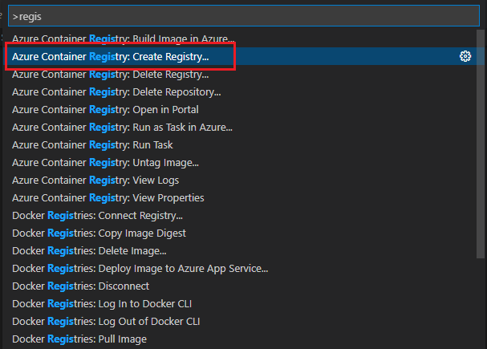
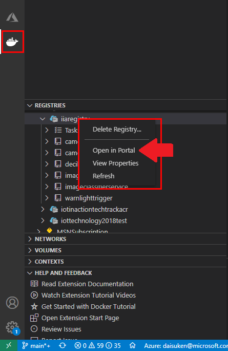
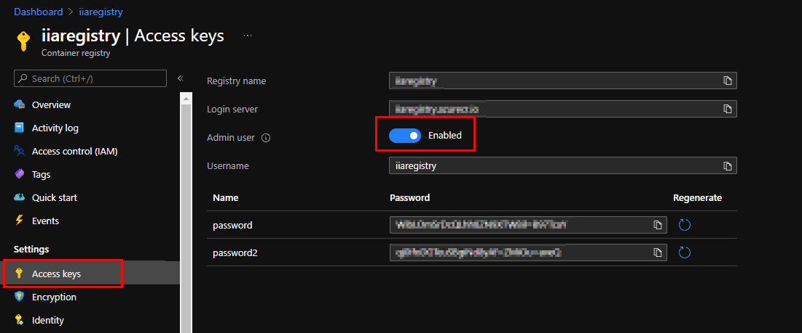
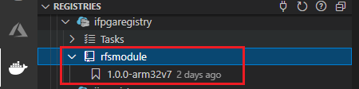

# Step 5: Container Development Phase

## Step 5: Goals

The goals for this step are :

- Containerize the reference application on your development machine
- Push the container to Azure Container Registry
- Validate the containerized application on DE10-Nano

## Step 5.1: Preparation

### Step 5.1.1: Summary of Tools and Resources

List of tools and required resources used in this step

- Development Machine
  - Docker or Moby engine
  - VSCode with extensions
    - IoT Hub extension
    - Docker extension

- DE10-Nano
  - Moby engine

- Files
  - `Dockerfile` from the reference application source
  - Reference application source code on your development machine

- Container Registry  
  You can use Azure Container Registry or Docker Hub

> [!NOTE]  
> Depending on your development machine and environment, you can perform the containerization on either :
>
> - Your development machine
> - DE10-Nano  
>
> Albeit, containerization on DE10-Nano will take more time.

### Step 5.1.2: Installing Docker to your development machine

You may choose any supported operating system to containerize the reference application.

- Windows  
[Install Docker Desktop for Windows](https://docs.docker.com/desktop/windows/install/).  
Make sure to select `Linux Container` during install.
- Mac  
[Install Docker Desktop for Mac](https://docs.docker.com/docker-for-mac/install/)
- Linux  
[Install Docker CE](https://docs.docker.com/install/)

### Step 5.1.3: Install Container Engine to DE10-Nano

Follow [installation tutorial](https://docs.microsoft.com/en-us/azure/iot-edge/how-to-install-iot-edge#install-a-container-engine)

<details><summary>Output Example</summary>

```bash
root@de10nano:~# docker version
Client:
 Version:           20.10.9+azure-1
 API version:       1.41
 Go version:        go1.16.8
 Git commit:        c2ea9bc90bacf19bdbe37fd13eec8772432aca99
 Built:             Thu Sep 23 18:26:34 2021
 OS/Arch:           linux/arm
 Context:           default
 Experimental:      true

Server:
 Engine:
  Version:          20.10.9+azure-1
  API version:      1.41 (minimum version 1.12)
  Go version:       go1.16.8
  Git commit:       79ea9d3080181d755855d5924d0f4f116faa9463
  Built:            Thu Sep 23 18:26:18 2021
  OS/Arch:          linux/arm
  Experimental:     false
 containerd:
  Version:          1.4.11+azure
  GitCommit:        5b46e404f6b9f661a205e28d59c982d3634148f8
 runc:
  Version:          1.0.2
  GitCommit:        52b36a2dd837e8462de8e01458bf02cf9eea47dd
 docker-init:
  Version:          0.19.0
  GitCommit:       
```

</details>

### Step 5.1.4: Create Azure Container Registry

If you already have an ACR instance from the previous tutorials, you may skip the remaining of this step.

1. Switch to VSCode that is **NOT** connected to DE10-Nano  
2. Open Command Palette (`CTRL+SHIFT+P` or `F1` on Windows)
3. Type `Registry`
4. Select `Azure Container Registry: Create Registry`

  

5. Follow the wizard to create a new ACR

    Reference : <https://code.visualstudio.com/docs/containers/quickstart-container-registries>

## Step 5.2: Containerize Application with VSCode

1. Clone source code from GitHub repo to your development machine  

    e.g. ~/terasic-de10-nano-kit on Ubuntu 20.04 PC

2. Open a new VSCode window
3. Select `File`, then `Open Folder`
4. Select `software-code` folder  

    e.g. ~/terasic-de10-nano-kit/azure-de10nano-document/sensor-aggregation-reference-design-for-azure/sw/software-code

5. In `VSCode` terminal, login to container registry with :  
  
    ```bash
    docker login -u <user name> -p <password> <container registry name>
    ```

    > [!TIP]  
    > If you prefer to perform local copy for deployment, you can compress image and copy to DE10-Nano from your development machine to DE10-Nano.
    > See [Appendix A : Copy docker image locally](#appendix-a---copy-docker-image-locally)
    > If you are containerizing on DE10-Nano, you may skip the remaining of the steps.

6. Open `.env` file with VSCode and add your container registry information  
  
    Example :

    ```bash
    CONTAINER_REGISTRY_ADDRESS=mydockerhub
    CONTAINER_REGISTRY_USERNAME=mydockerhubusername
    CONTAINER_REGISTRY_PASSWORD=mydockerhubpassword

    or with Azure Container Registry

    CONTAINER_REGISTRY_ADDRESS=mydockerhub.azurecr.io
    CONTAINER_REGISTRY_USERNAME=acrusername
    CONTAINER_REGISTRY_PASSWORD=acrpassword
    ```
  
    > [!NOTE]  
    > If your container registry is public, you can ignore `CONTAINER_REGISTRY_USERNAME` and `CONTAINER_REGISTRY_PASSWORD`

    > [!TIP]  
    > To find username and password for ACR :
    >
    > 1. Click `Docker` icon in the left bar
    > 1. Under `Registries`, locate your ACR
    > 1. Right click and select `Open in Portal`
    >  
    > 
    >
    > This will take you to Azure Portal in your default web browser
    > Click on `Access keys` and enable `Admin user` to see username and password
    >
    > 

7. Once your container registry is ready, login to container registry in VSCode terminal  

    ```bash
    docker login <Container Registry URL> -u <User Name>
    ```

    Enter password when prompted

    e.g. with ACR `ifpgaregistry.azurecr.io`

    ```bash
    docker login ifpgaregistry.azurecr.io -u ifpgaregistry
    ```

    e.g. Using Docker Hub and docker hub username is `ifpgauser`

    ```bash
    docker login -u ipgauser 
    ```

8. Right click on `deployment.template.json`
9. Select `Build and Push IoT Edge solution`  

    > [!IMPORTANT]  
    > If you prefer to perform local copy for deployment or performing containerizing on DE10-Nano, select `Build IoT Edge Solution` (do not push to container registry).  
    > Then copy container image if you are building locally on development machine. ([Instruction](#appendix-a--copy-docker-image-locally))

10. Wait for docker image build to complete, which includes containerizing the reference application.
11. Ensure you do not see any error in the terminal

    <details><summary>VSCode Output Sample</summary>

    ```bash
    ifpga@NUCUBUNTU20:~/terasic-de10-nano-kit/azure-de10nano-document/sensor-aggregation-reference-design-for-azure/sw/software-code$ docker build  --rm -f "/home/ifpga/terasic-de10-nano-kit/azure-de10nano-document/sensor-aggregation-reference-design-for-azure/sw/software-code/modules/RfsModule/Dockerfile.arm32v7" -t mydockerhub/rfsmodule:1.0.0-arm32v7 "/home/ifpga/terasic-de10-nano-kit/azure-de10nano-document/sensor-aggregation-reference-design-for-azure/sw/software-code/modules/RfsModule" && docker push mydockerhub/rfsmodule:1.0.0-arm32v7
    Sending build context to Docker daemon  2.544MB
    Step 1/14 : FROM arm32v7/python:3.7-buster as builder
    3.7-buster: Pulling from arm32v7/python
    2d333743b3b2: Pull complete 
    376d8928e133: Pull complete 
    a975074459ff: Pull complete 
    6a11c276eb14: Pull complete 
    ee394d962f6e: Pull complete 
    53ae4925f793: Pull complete 
    2e8ec9eef492: Pull complete 
    bb243986af5b: Pull complete 
    f3f6b31abd61: Pull complete 
    Digest: sha256:4bd6f6fd506990c542d3b8ed3941df656e497f48f15edcf485ee429e0ae60361
    Status: Downloaded newer image for arm32v7/python:3.7-buster
    ---> 516e6dd1f3d4
    Step 2/14 : WORKDIR /app
    ---> [Warning] The requested image's platform (linux/arm/v7) does not match the detected host platform (linux/amd64) and no specific platform was requested
    ---> Running in fad13fdb1425
    Removing intermediate container fad13fdb1425
    ---> 6b0d211a64b5
    Step 3/14 : COPY requirements.txt ./
    ---> 0c435a57e2fe
    Step 4/14 : RUN pip install -r requirements.txt
    ---> [Warning] The requested image's platform (linux/arm/v7) does not match the detected host platform (linux/amd64) and no specific platform was requested
    ---> Running in daa87423076e
    Collecting azure-iot-device
      Downloading azure_iot_device-2.7.1-py2.py3-none-any.whl (163 kB)
    Collecting six
      Downloading six-1.16.0-py2.py3-none-any.whl (11 kB)
    Collecting smbus2
      Downloading smbus2-0.4.1-py2.py3-none-any.whl (11 kB)
    Collecting urllib3<1.27,>=1.26.5
      Downloading urllib3-1.26.7-py2.py3-none-any.whl (138 kB)
    Collecting requests-unixsocket<1.0.0,>=0.1.5
      Downloading requests_unixsocket-0.2.0-py2.py3-none-any.whl (11 kB)
    Collecting requests<3.0.0,>=2.20.0
      Downloading requests-2.26.0-py2.py3-none-any.whl (62 kB)
    Collecting janus==0.4.0
      Downloading janus-0.4.0-py3-none-any.whl (7.0 kB)
    Collecting deprecation<3.0.0,>=2.1.0
      Downloading deprecation-2.1.0-py2.py3-none-any.whl (11 kB)
    Collecting paho-mqtt<2.0.0,>=1.4.0
      Downloading paho-mqtt-1.5.1.tar.gz (101 kB)
    Collecting PySocks
      Downloading PySocks-1.7.1-py3-none-any.whl (16 kB)
    Collecting packaging
      Downloading packaging-21.0-py3-none-any.whl (40 kB)
    Collecting charset-normalizer~=2.0.0
      Downloading charset_normalizer-2.0.6-py3-none-any.whl (37 kB)
    Collecting certifi>=2017.4.17
      Downloading certifi-2021.5.30-py2.py3-none-any.whl (145 kB)
    Collecting idna<4,>=2.5
      Downloading idna-3.2-py3-none-any.whl (59 kB)
    Collecting pyparsing>=2.0.2
      Downloading pyparsing-2.4.7-py2.py3-none-any.whl (67 kB)
    Building wheels for collected packages: paho-mqtt
      Building wheel for paho-mqtt (setup.py): started
      Building wheel for paho-mqtt (setup.py): finished with status 'done'
      Created wheel for paho-mqtt: filename=paho_mqtt-1.5.1-py3-none-any.whl size=61565 sha256=18d0c848b458bf330370f46dd85ddc829bbfe421762f426351cdbff94f017071
      Stored in directory: /root/.cache/pip/wheels/c9/be/2a/883db47312c70ef7ffcaff281f3294e3075f62da075474d4bb
    Successfully built paho-mqtt
    Installing collected packages: urllib3, pyparsing, idna, charset-normalizer, certifi, requests, packaging, six, requests-unixsocket, PySocks, paho-mqtt, janus, deprecation, smbus2, azure-iot-device
    Successfully installed PySocks-1.7.1 azure-iot-device-2.7.1 certifi-2021.5.30 charset-normalizer-2.0.6 deprecation-2.1.0 idna-3.2 janus-0.4.0 packaging-21.0 paho-mqtt-1.5.1 pyparsing-2.4.7 requests-2.26.0 requests-unixsocket-0.2.0 six-1.16.0 smbus2-0.4.1 urllib3-1.26.7
    WARNING: Running pip as the 'root' user can result in broken permissions and conflicting behaviour with the system package manager. It is recommended to use a virtual environment instead: https://pip.pypa.io/warnings/venv
    Removing intermediate container daa87423076e
    ---> e59d844f3e4a
    Step 5/14 : FROM arm32v7/python:3.7-slim-buster
    3.7-slim-buster: Pulling from arm32v7/python
    421f17c52123: Pull complete 
    17ec1e0d3d49: Pull complete 
    dd2a1ec13ebd: Pull complete 
    f1858fbc58ab: Pull complete 
    6083f42760f4: Pull complete 
    Digest: sha256:d12f2a4565c864153b97cf453e565d01f57245aee52f0d96f56a041900f5e38a
    Status: Downloaded newer image for arm32v7/python:3.7-slim-buster
    ---> 0ab4b6bfb92e
    Step 6/14 : WORKDIR /app
    ---> [Warning] The requested image's platform (linux/arm/v7) does not match the detected host platform (linux/amd64) and no specific platform was requested
    ---> Running in f93984ae71ca
    Removing intermediate container f93984ae71ca
    ---> a4919fb7101f
    Step 7/14 : COPY --from=builder /usr/local/lib/python3.7/site-packages /usr/local/lib/python3.7/site-packages
    ---> 655b246a8f6c
    Step 8/14 : COPY ./package ./package
    ---> fc903aa9efcf
    Step 9/14 : COPY ./main.py .
    ---> ab37c5d3d7a8
    Step 10/14 : COPY ./overlay/Module5_Sample_HW.rbf .
    ---> 32a8f2c88ffe
    Step 11/14 : COPY ./overlay/rfs-overlay.dtbo .
    ---> cf1f75ae9631
    Step 12/14 : COPY ./overlay/run_container_app.sh ./run.sh
    ---> 76cf47111ece
    Step 13/14 : RUN chmod +x run.sh
    ---> [Warning] The requested image's platform (linux/arm/v7) does not match the detected host platform (linux/amd64) and no specific platform was requested
    ---> Running in 132c52fecce3
    Removing intermediate container 132c52fecce3
    ---> b5712e0145c1
    Step 14/14 : CMD [ "/app/run.sh"]
    ---> [Warning] The requested image's platform (linux/arm/v7) does not match the detected host platform (linux/amd64) and no specific platform was requested
    ---> Running in 83292e65f5a5
    Removing intermediate container 83292e65f5a5
    ---> d553ff3a511e
    Successfully built d553ff3a511e
    Successfully tagged mydockerhub/rfsmodule:1.0.0-arm32v7
    The push refers to repository [docker.io/mydockerhub/rfsmodule]
    5dc7b5c6f558: Pushed 
    9cf3bc291b56: Pushed 
    6530ec6d845f: Pushed 
    99bb24a0a8b9: Pushed 
    d7c149b486bc: Pushed 
    5a4733129a0f: Pushed 
    94e2c96d5951: Pushed 
    1bad5819d158: Pushed 
    a77cfe4a09ef: Mounted from arm32v7/python 
    ed0801ab298f: Mounted from arm32v7/python 
    62b72263fefa: Mounted from arm32v7/python 
    0f0d2ab87650: Mounted from arm32v7/python 
    8722b71b1432: Mounted from arm32v7/python 
    1.0.0-arm32v7: digest: sha256:83854ffb30e7bac34d24702cf5a9bbed6185f4f4f88ebe2d6238b89dece12950 size: 3035
    ```

    </details>

12. Confirm your container is built and pushed to your container registry.

    

### Additional Information on Building a Container Image with Dockerfile

A `Dockerfile` is a series of commands to create an executable environment within a containerized environment, which is typically consists of the following steps :

- Base image  
  Select a base image that best meets for your application. Make sure to use an `arm32v7` image.
- Install tools and libraries for your application
- Copy source code
- Compile application
- Set variables
- Launch application

After modification to the source codes, such as adding support of a new sensor that requires additional Python package, you will need to add the package to `requirements.txt`, and initiate a container image rebuild.

> [!TIP]  
> You may change `image:tag:version` by editing `.env` and `module.json` file

Do confirm your container image is built and pushed to the container registry by checking the VSCode terminal.

## Step 5.3: Run Container

DE10-Nano can pull (download) your new container image from container registry, and then you can run the container on DE10-Nano.

1. Open VSCode that is connected to DE10-Nano
1. If you are using non-public registry (ACR or private Docker Hub), login to registry from DE10-Nano  

    ```bash
    docker login <Registry> -u <User Name>
    ```

1. Run the container  

    - Replace `<Device Connection String>` with Device Connection String from IoT Explorer or VSCode
    - Replace `<Container Registry>` with your container registry
    - Replace `<Container Tag>` with your container's tag

    ```bash
    docker run -it --rm --privileged -v /sys/kernel/config:/sys/kernel/config -v /lib/firmware:/lib/firmware -e IOTHUB_DEVICE_SECURITY_TYPE="connectionString" -e IOTHUB_DEVICE_CONNECTION_STRING="<Device Connection String>" <Container Registry>/rfsmodule:<Container Tag>
    ```

    e.g.
    - ACR name is ifpgaregistry.azurecr.io
    - Container tag is 1.0.0-arm32v7

    ```bash
    docker run -it --rm --privileged -v /sys/kernel/config:/sys/kernel/config -v /lib/firmware:/lib/firmware -e IOTHUB_DEVICE_SECURITY_TYPE="connectionString" -e IOTHUB_DEVICE_CONNECTION_STRING="<Device Connection String>" ifpgaregistry.azurecr.io/rfsmodule:1.0.0-arm32v7
    ```

    e.g.
    - Docker Hub name is ifpgadocker
    - Conatiner tag is 1.0.1-arm32v7

    ```bash
    docker run -it --rm --privileged -v /sys/kernel/config:/sys/kernel/config -v /lib/firmware:/lib/firmware -e IOTHUB_DEVICE_SECURITY_TYPE="connectionString" -e IOTHUB_DEVICE_CONNECTION_STRING="<Device Connection String>" ifpgadocker/rfsmodule:1.0.1-arm32v7
    ```

1. Open IoT Explorer, then navigate to `Telemetry`
2. Validate the following, you can refer to [Step 4: Device Application Development Phase](step4-software-development-phase.md). 
    - Telemetry data is displayed in IoT Explorer  
    - Writable Property can be sent from IoT Hub to the containerized application

Stop the container by pressing `q` key in VSCode Terminal window before proceeding to the next step.


---

## Appendix A : Copy Docker Image Locally to DE10-Nano

1. [Complete building a container image.](#step-52-containerize-application-with-vscode)  
    To build container image, right Click on `module.json` and select `Build IoT Edge Module Image`(Don't push the image).  
    *Note: You may change `image:tag:version` in module.json to manage container images versioning*

2. Compress and copy it to DE10-Nano  
    Check the image with `docker images` from the terminal in VSCode and copy the image to DE10-Nano.
    ```
    docker images #Check container images
    docker save <your ACR repository address>/-module:0.0.1-arm32v7 -o rfs-container.tar #Compress a container image
    scp rfs-container.tar root@<DE10-Nano IP address>:~/rfs-test/ #Copy the compressed image
    ```

3. Uncompress and launch a container with options  
    Open a terminal console on the DE10-Nano, then load and test the container image.
    ```
    docker load -i ~/rfs-test/rfs-container.tar #Uncompress the image
    docker run --privileged -d -v /sys/kernel/config:/sys/kernel/config -v /lib/firmware:/lib/firmware -e IOTHUB_DEVICE_SECURITY_TYPE="connectionString" -e IOTHUB_DEVICE_CONNECTION_STRING="HostName=;DeviceId=;SharedAccessKey=" -e IOTEDGE_GATEWAYHOSTNAME=de10nano <ACR repository address>/rfsmodule:0.0.1-arm32v7
    ```
    *Note:The options above are basic to run the reference application container and if you need access to external devices such as camera or open ports later, you will need to add additional options*

    In this reference application, it requires several environment variables which you have to define them with `-e` option when starting the container image.  

    In later step, Azure IoT Edge will provide these environment variables, thus you don't need to define them manually when deployment is done through Azure IoT Edge.  

    You can confirm successful starting execution of the container image through `docker ps`, and retrieve the `CONTAINER ID`

    Check the execution of the containerized reference application by `docker logs <CONTAINER ID>`. The logs will be similar to **Step 4** where the `docker logs` display the logs locally from DE10-Nano, and Azure IoT Explorer displays the logs from cloud.  
    Here's a sample of the logs :
    ```
    # docker run --privileged  -v /sys/kernel/config:/sys/kernel/config -v /lib/firmware:/lib/firmware -e IOTHUB_DEVICE_SECURITY_TYPE="connectionString" -e IOTHUB_DEVICE_CONNECTION_STRING="HostName=;DeviceId=;SharedAccessKey=" -e IOTEDGE_GATEWAYHOSTNAME=de10nano -d <ACR repository address>/rfsmodule:0.0.1-arm32v7
    4cc57e2cdd3e082dba02bf1cc79a4ce34e93b0879af08e15610f824e2ae4604d
    # docker ps
    CONTAINER ID        IMAGE                                              COMMAND             CREATED             STATUS              PORTS               NAMES
    4cc57e2cdd3e        <ACR repository address>/rfsmodule:0.0.1-arm32v7   "/app/run.sh"       13 seconds ago      Up 11 seconds                           kind_neumann
    # docker stop 4cc
    4cc
    root@de10nano:/overlay# docker logs 4cc
    Deleting /sys/kernel/config/device-tree/overlays/socfpga
    Copy DTBO and RBF
    creating /sys/kernel/config/device-tree/overlays/socfpga
    Doing Device Tree Overlay
    Successfully Device Tree Overlay Done.
    Message : Application Start
    (Omitted since it's the same as Step 4)
    ```

    With the previous steps completed, you can check the container options by using `docker inspect`.
    ```
    docker inspect <CONTAINER ID> > docker-info.json
    ```
    The settings will be used in **Step 6**.

    To stop the container, you can use `docker stop` command.
    ```
    docker stop <CONTAINER ID>
    ```

---
Next Step: [Step 6: Azure IoT Module Enablement Phase](step6-azure-iot-module-enablement-phase.md)  
Previous Step: [Step 4: Device Application Development Phase](step4-software-development-phase.md)

Tool Setup: [Prerequisites Guide](prerequisites.md)  
Learn this Design: [Sensor Aggregation Design Architecture](reference-design.md)  
Move to [Top](../top.md)