# Step 7: Azure IoT Central Application Development Phase

As the tutorial progresses till now, the reference application is deployed as IoT Edge Module running in containerized environment on DE10-Nano, and connected to IoT Hub. While we are able to view the telemetry data from IoT Explorer, but this is not scalable. Imagine you have multiple DE10-Nano devices to monitor and provision, it will be hard without a central monitoring and control application.

To showcase this capability from Azure IoT, we are going to provision DE10-Nano with an Azure IoT Central application.

## Azure IoT Central

Azure IoT Central (IoTC) is a Software as a Service (SaaS) offering from Microsoft. IoT Central is a fully managed IoT SaaS solution to build enterprise class IoT solution without requiring special skills and expertise in cloud application development.

You can deploy an IoTC application in a few minutes within your web browser. It includes functionalities such as :

- Device Management and provisioning
- Role based user management
- Low-code development environment
- Rule based trigger support
- Fast & easy way for data analysis and visualization
- Easy integration with machine learning services

## Goals

The goals for this step are :

- Creeate and deploy IoT Central application
- Create a Device Template for DE10-Nano, including visualization
- Configure DE10-Nano for IoT Central application
- Provision DE10-Nano to IoT Central application

## Step 7.1: Preparation

### Step 7.1.1: Summary of Tools and Resources

List of tools and required resources used in this step

- Azure Subscription
- Web browser of your choice, e.g. Microsoft Edge
- DE10-Nano with IoT Edge Runtime

## Step 7.2: Deploy Azure IoT Central Application

1. Browse to <https://azureiotcentral.com>
1. Click `Build a solution`

    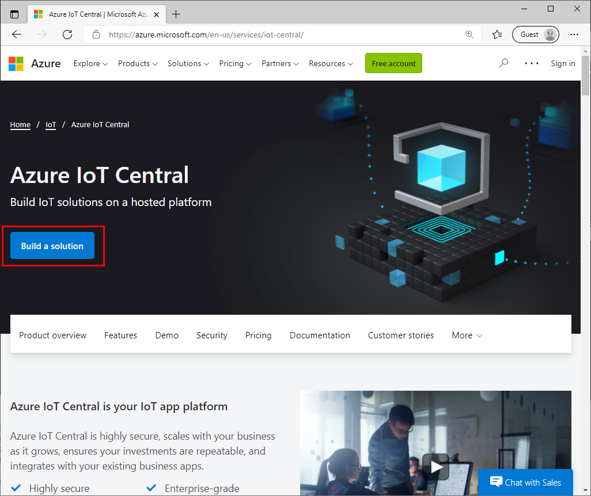

1. Select `Build` from side navigation
1. Click `Create app`

    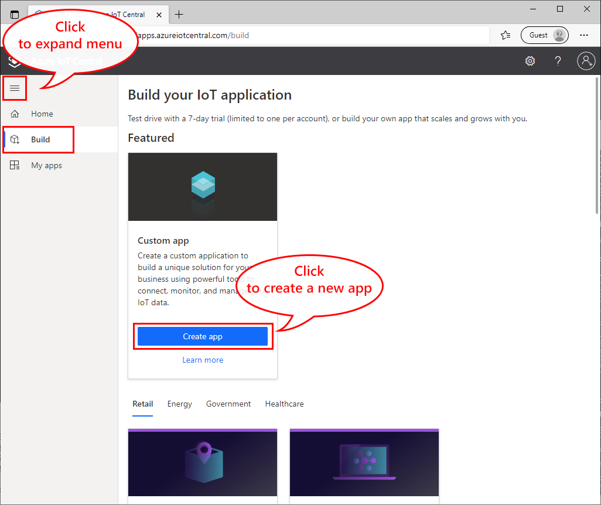

    > [!NOTE]  
    > This will take you to Sign in page if you are not signed in.
    > Sign in using your Microsoft Account with Azure Subscription

1. Complete **About your app** section

    Give a name for your new IoT Central application

    URL is auto generated based on Application Name. However, you can specify a different URL.

    > [!IMPORTANT]
    > URL must be globally unique.

    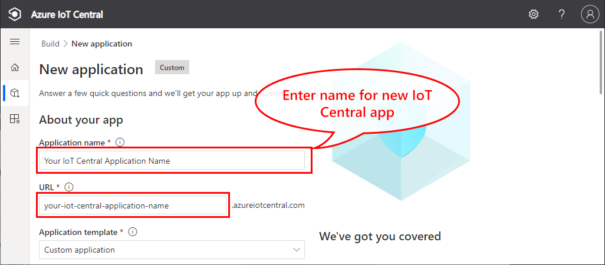

1. Select a **Pricing plan**

    Choose an appropriate pricing plan for your application from 4 available selections. Each pricing plan offers different pricing point with different quotas.

    Choose `Standard 2` since you are going to connect only one DE10-Nano, you get 2 free device connection with this option.

    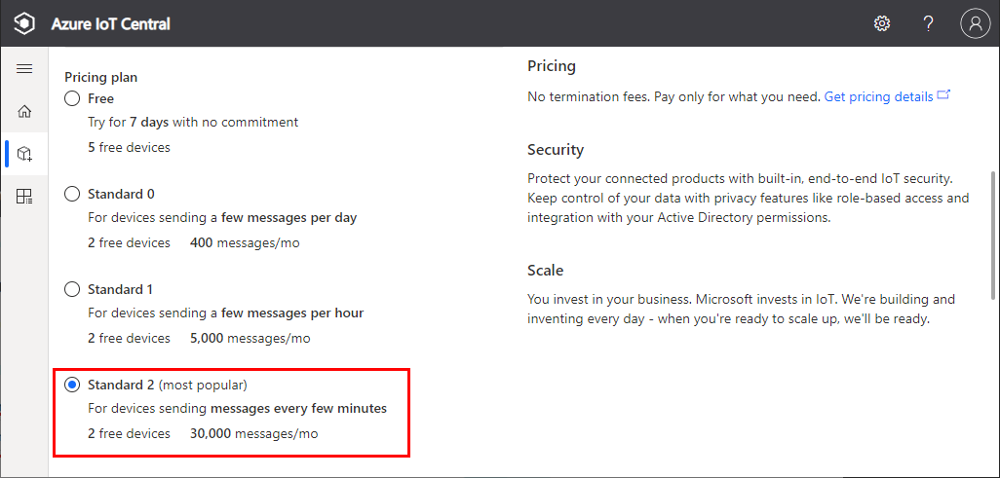

1. Select **Azure Subscription**

    Select Azure Subscription and Location for your new IoT Central application.

    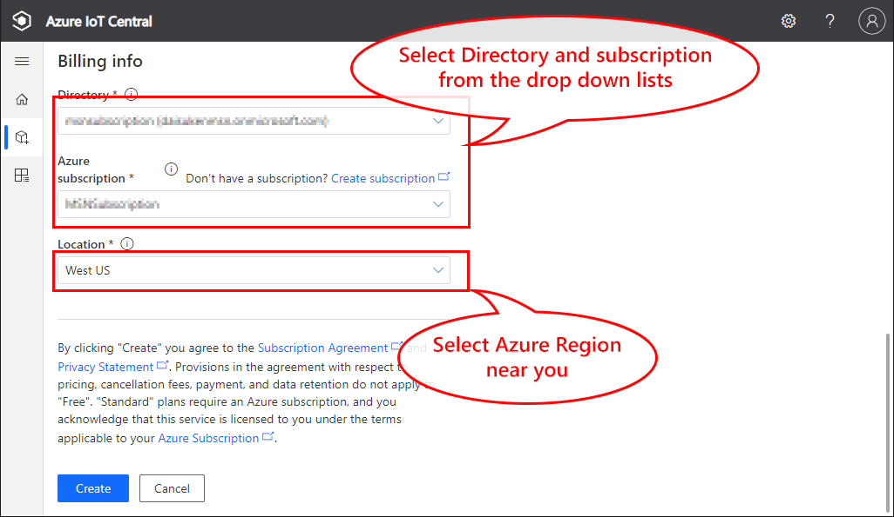

1. Click `Create` to start deployment

    Wait for the deployment to complete.

    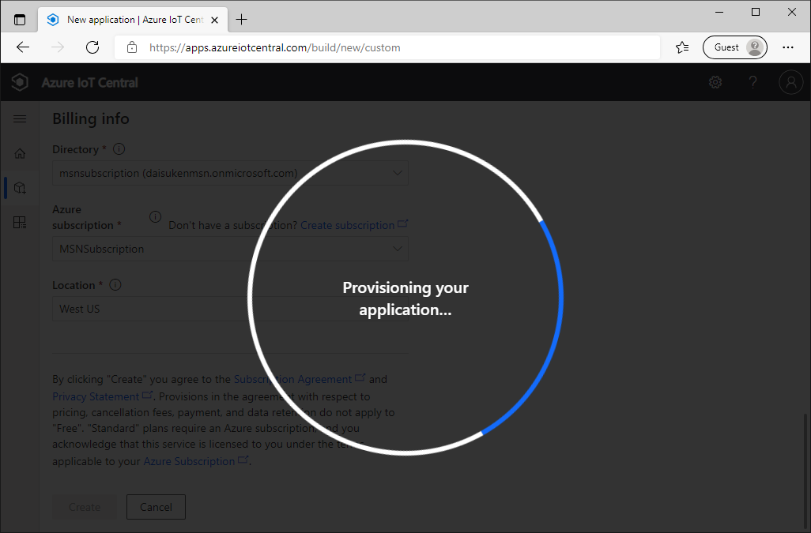

Your new IoT Central application is ready.

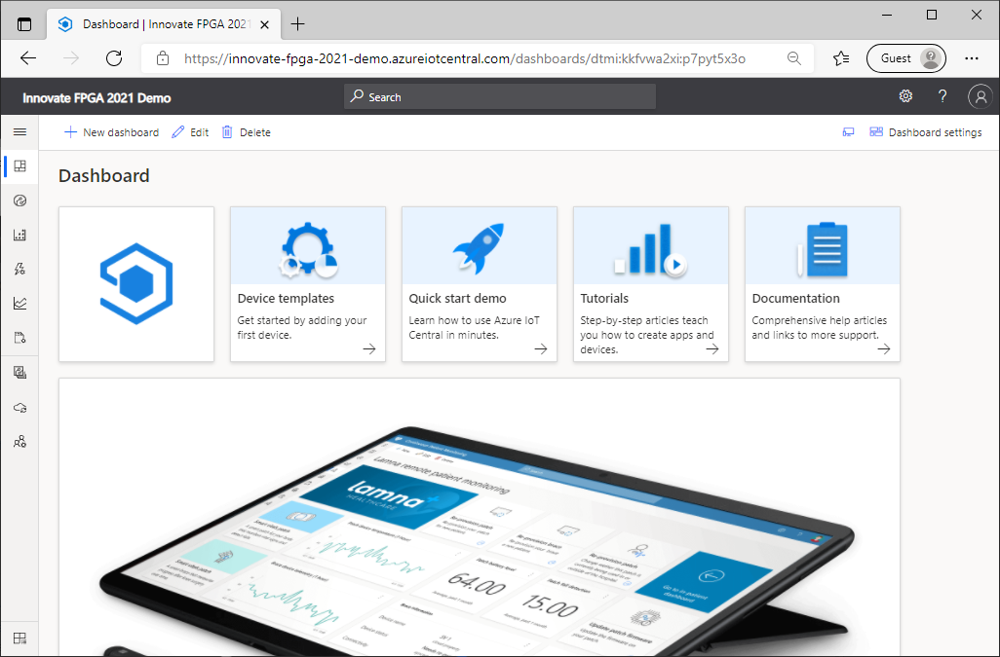

### Device Template

IoT Central uses **Device Template** to manage devices. Device Template defines characteristics and behavior of devices that connect to your IoT Central application.

Device Template includes :

- A device model
- Cloud Properties
- Customizations
- Views

Learn more about Device Template : <https://docs.microsoft.com/azure/step7-iot-central/core/concepts-device-templates>

### Device Model

This part of the device template defines how the device interacts with your application, it's written in Digital Twin Definition Language (DTDL) that contains :

- Telemetry a device sends
- Properties a device reports to IoT Central
- Properties a device can receive from IoT Central
- Commands a device respond to

Standard Device Model for DE10-Nano Cloud Connectivity Kit is defined and published to [Microsoft Model Repository](https://github.com/Azure/iot-plugandplay-models/tree/main/dtmi/terasic/fcc).

You can use the default device model from Terasic or your own custom device model.

## Step 7.3: Create Device Template for DE10-Nano

1. Select `Device templates` from Side Navigation
1. Click `+ New` to create a new device template

    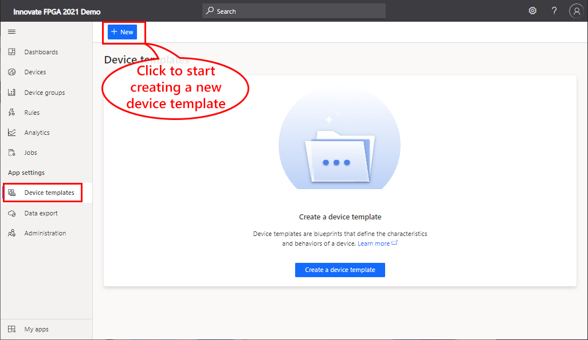

1. Select `Azure IoT Edge` device template type, then click `Next: Customize`

    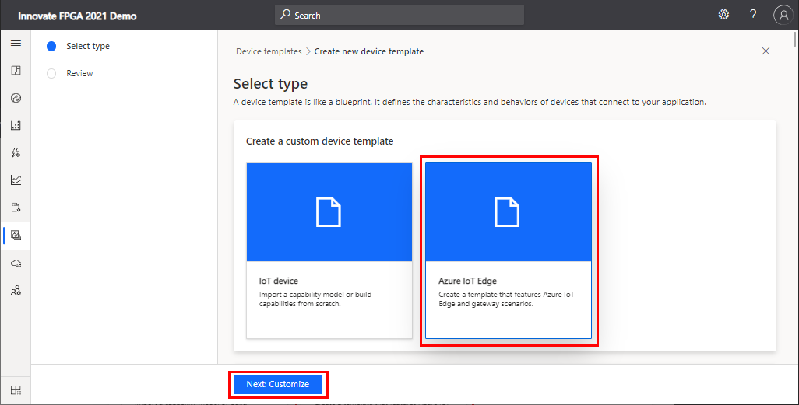

1. Give a name to the new device template

    e.g. DE10-Nano-IoTC-Edge

    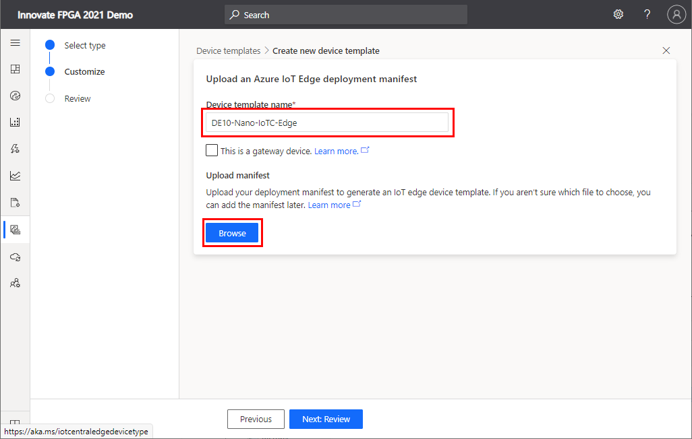

1. Click `Browse` button and navigate to the path where you cloned the reference application in **Step 4** for the file `deployment.arm32v7.json`

    e.g. C:\terasic-de10-nano-kit\azure-de10nano-document\sensor-aggregation-reference-design-for-azure\sw\software-code\config\deployment.arm32v7.json

    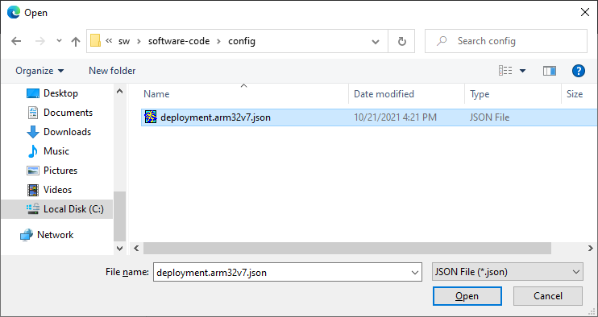

1. Confirm the deployment manifest is loaded and successfully `Validated`

    Click `Next: Review` to continue

    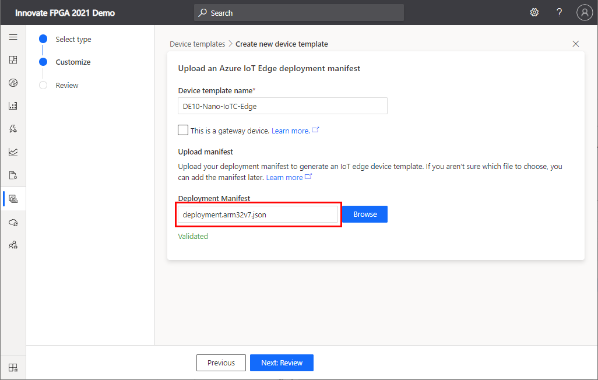

1. Review the information and click `Create` to create a new device template

    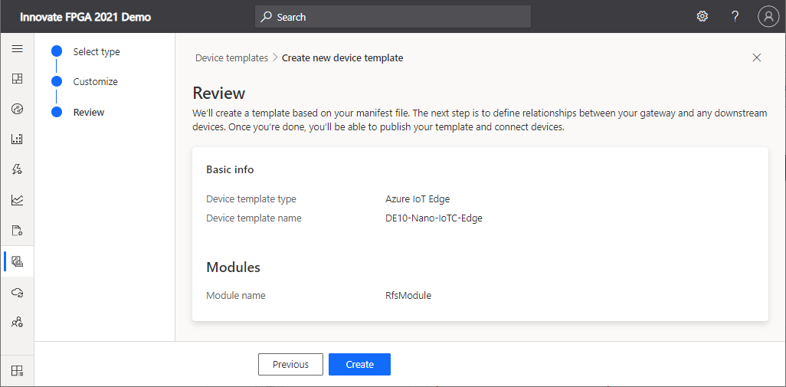

1. Confirm IoT Central generated a new device template in **draft** mode

    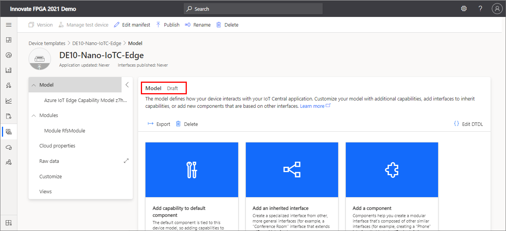

## Step 7.4: Adding IoT Plug and Play model to the device template

The IoTC device template includes **Device Model**, and the new device template generated using the deployment manifest contains information on reference application IoT Edge Module.  
The reference application IoT Edge Module is written for the model explained [above](#device-model), and you will need to define device model in your IoTC application in DTDLv2.

1. Download Device Definition files for DE10-Nano from <https://github.com/Azure/iot-plugandplay-models/tree/main/dtmi/terasic/fcc>

    - de10_nano-1.json
    - de10_nano_sensor-1.json
    - de10_nano_threshold-1.json
    - rfs-1.json

    > [!TIP]  
    > Here is an example of downloading these files using CURL
    >
    > ```bash
    > curl -o de10-nano-1.json https://raw.githubusercontent.com/Azure/iot-plugandplay-models/main/dtmi/terasic/fcc/de10_nano-1.json
    > curl -o de10_nano_sensor-1.json https://raw.githubusercontent.com/Azure/iot-plugandplay-models/main/dtmi/terasic/fcc/de10_nano_sensor-1.json
    > curl -o de10_nano_threshold-1.json https://raw.githubusercontent.com/Azure/iot-plugandplay-models/main/dtmi/terasic/fcc/de10_nano_threshold-1.json
    > curl -o rfs-1.json https://raw.githubusercontent.com/Azure/iot-plugandplay-models/main/dtmi/terasic/fcc/rfs-1.json
    >
    > Example
    > ```cmd
    > C:\devicemodel>curl -o de10_nano-1.json https://raw.githubusercontent.com/Azure/iot-plugandplay-models/main/dtmi/terasic/fcc/de10_nano-1.json
    >   % Total    % Received % Xferd  Average Speed   Time    Time     Time  Current
    >                                  Dload  Upload   Total   Spent    Left  Speed
    > 100  1444  100  1444    0     0   1444      0  0:00:01 --:--:--  0:00:01 15361
    > 
    > C:\devicemodel>curl -o de10_nano_sensor-1.json https://raw.githubusercontent.com/Azure/iot-plugandplay-models/main/dtmi/terasic/fcc/de10_nano_sensor-1.json
    >   % Total    % Received % Xferd  Average Speed   Time    Time     Time  Current
    >                                  Dload  Upload   Total   Spent    Left  Speed
    > 100  1270  100  1270    0     0   1270      0  0:00:01 --:--:--  0:00:01 20158
    > 
    > C:\devicemodel>curl -o de10_nano_threshold-1.json https://raw.githubusercontent.com/Azure/iot-plugandplay-models/main/dtmi/terasic/fcc/de10_nano_threshold-1.json
    >   % Total    % Received % Xferd  Average Speed   Time    Time     Time  Current
    >                                  Dload  Upload   Total   Spent    Left  Speed
    > 100  5649  100  5649    0     0   5649      0  0:00:01 --:--:--  0:00:01 19020
    > 
    > C:\devicemodel>curl -o rfs-1.json https://raw.githubusercontent.com/Azure/iot-plugandplay-models/main/dtmi/terasic/fcc/rfs-1.json
    >   % Total    % Received % Xferd  Average Speed   Time    Time     Time  Current
    >                                  Dload  Upload   Total   Spent    Left  Speed
    > 100  4019  100  4019    0     0   4019      0  0:00:01 --:--:--  0:00:01 16076
    > 
    > C:\devicemodel>dir
    >  Volume in drive C has no label.
    >  Volume Serial Number is 56DA-BAA9
    > 
    >  Directory of C:\devicemodel
    > 
    > 10/21/2021  04:50 PM    <DIR>          .
    > 10/21/2021  04:50 PM    <DIR>          ..
    > 10/21/2021  04:50 PM             1,444 de10_nano-1.json
    > 10/21/2021  04:50 PM             1,270 de10_nano_sensor-1.json
    > 10/21/2021  04:50 PM             5,649 de10_nano_threshold-1.json
    > 10/21/2021  04:50 PM             4,019 rfs-1.json
    >                4 File(s)         12,382 bytes
    >                2 Dir(s)  771,617,697,792 bytes free
    > ```

2. Select `Module RfsModule`, then click on `{} Edit DTDL`

    

3. Replace the contents with contents of de10_nano-1.json, click `Save`, then click `X` to close the edit window

    

    to

    

4. Ensure all 3 components are added

    

5. Select `DE10-Nano-Onboard Sensor` component, then `{} Edit DTDL`

    

6. Replace the contents with the contents from de10_nano_sensor-1.json, then `Save` and close

    

7. Confirm `G-Sensor` capability is shown

    

8. Repeat the same steps on `RFS Daughter Card` (rfs-1.json) and `Sensor Threshold Properties` (de10_nano_threshold-1.json)

    

    

You have now defined device model for **RfsModule**, all interfaces (telemetry, properties) are available in both `Model` and `Customize` views. If you want to change Display Names etc..., you may do so under `Customize` view.


## Step 7.5: Publish Device Template

As an IoT Central Application administrator, you have just created a new device template for your DE10-Nano. The device template is in **Draft** mode, it must be published to be useable by the IoTC application.

1. Click on `Publish` button at the top, then click `Publish` button again.

    

1. Confirm the device template is **Published**

    

1. Select `Devices` from Side Navigation, and confirm the new device template is shown there

    

## Step 7.6: Provision DE10-Nano to your IoT Central Application

With a new published device template, your IoT Central application is ready to accept device connection and provisioning.

### Step 7.6.1: Register DE10-Nano to IoT Central application

By registering DE10-Nano to your IoT Central application, this device becomes a known device, and this prevents random devices connecting to your IoT Central application.

1. Select the device template for DE10-Nano
1. Click `Create` button to create a new device identity

    

1. Enter `Device name` and `Device ID`

    - Device Name is a user-friendly name used in UI

        e.g. DE10-Nano-IoTC-Edge 01

    - Device ID is unique identity for this specific device

        e.g. DE10Nano-001

    

1. Click `Create` to create a new device identity
1. Confirm a new device identity is created

    Device status should be **`Registered`**

    

### Step 7.6.2: Configure DE10-Nano with provisioning information

Once a new device identity is registered in your IoT Central application, you can proceed to configure DE10-Nano with provisioning information, so your DE10-Nano connects to your IoT Central application.

This step is similar to [Step 6.3: Configure IoT Edge](step6.md#step-63-configure-iot-edge), with DPS provisioning method instead.

1. Select the new device identity you just created

    

2. Click `Connect` to display provisioning information

    

3. Switch to the console that is connected to your DE10-Nano
4. Open `/etc/aziot/config.toml` with your favorite text editor

    e.g. With Nano editor

    ```bash
    nano /etc/aziot/config.toml
    ```

    > [!IMPORTANT]  
    > If you have provisioned DE10-Nano to IoT Hub in Step 6, make sure to comment out sections you enabled.
    > You may copy `config.toml.template` to `config.toml` to start fresh.
    >
    > ```bash
    > cp /etc/aziot/config.toml.template /etc/aziot/config.toml
    > ```

5. Find the section starts with `## DPS provisioning with symmetric key` (Line 82)

    ```toml
    ## DPS provisioning with symmetric key
    # [provisioning]
    # source = "dps"
    # global_endpoint = "https://global.azure-devices-provisioning.net/"
    # id_scope = "0ab1234C5D6"
    #
    # [provisioning.attestation]
    # method = "symmetric_key"
    # registration_id = "my-device"
    #
    # symmetric_key = { value = "YXppb3QtaWRlbnRpdHktc2VydmljZXxhemlvdC1pZGVudGl0eS1zZXJ2aWNlfGF6aW90LWlkZW50aXR5LXNlcg==" } # inline key (base64), or...
    # symmetric_key = { uri = "file:///var/secrets/device-id.key" }                                                          # file URI, or...
    # symmetric_key = { uri = "pkcs11:slot-id=0;object=device%20id?pin-value=1234" }                                         # PKCS#11 URI
    ```

6. Remove **#** from the beginning of each line, and then copy and paste following information from your IoT Central application

    - ID scope for `id_scope`
    - Device ID for `registration_id`
    - Primary Key for `symmetric_key`

    Example :

    ```toml
    ## DPS provisioning with symmetric key
    [provisioning]
    source = "dps"
    global_endpoint = "https://global.azure-devices-provisioning.net/"
    id_scope = "0ne00401BB0"
    
    [provisioning.attestation]
    method = "symmetric_key"
    registration_id = "DE10Nano-001"
    
    symmetric_key = { value = "c3SOQF6ABmikwK4JNKQAcL+zg/EIE207w1A+rvAy27Y=" } # inline key (base64), or...
    # symmetric_key = { uri = "file:///var/secrets/device-id.key" }                                                          # file URI, or...
    # symmetric_key = { uri = "pkcs11:slot-id=0;object=device%20id?pin-value=1234" }                                         # PKCS#11 URI
    ```

    > [!TIP]  
    > You can click blue button on the right of each entry in IoT Central application to copy the value to system clipboard.  
    > Enable only one line of symmetric_key, with `value` attribute to pass Primary Key.  
    > Key can be primary key or secondary key.

7. Save the changes

    e.g. With Nano editor, `Ctrl+x` to save and exit.

8. Apply the provisioning information with `iotedge config apply` command

    Example : 

    ```bash
    root@de10nano:~# iotedge config apply
    Note: Symmetric key will be written to /var/secrets/aziot/keyd/device-id
    Azure IoT Edge has been configured successfully!
    
    Restarting service for configuration to take effect...
    Stopping aziot-edged.service...Stopped!
    Stopping aziot-identityd.service...Stopped!
    Stopping aziot-keyd.service...Stopped!
    Stopping aziot-certd.service...Stopped!
    Stopping aziot-tpmd.service...Stopped!
    Starting aziot-edged.mgmt.socket...Started!
    Starting aziot-edged.workload.socket...Started!
    Starting aziot-identityd.socket...Started!
    Starting aziot-keyd.socket...Started!
    Starting aziot-certd.socket...Started!
    Starting aziot-tpmd.socket...Started!
    Starting aziot-edged.service...Started!
    Done.
    ```

9. Navigate back to `Devices` view and confirm `Device status` changes from **`Registered`** to **`Provisioned`**

    

10. Click on the `Device name` to go into the device identity page, and confirm the 3 modules are **Running**

    > [!NOTE]  
    > Initial deployment may take a few minutes depending on network speed for DE10-Nano.

    > [!TIP]  
    > IoT Central will automatically refresh the views for IoT Edge Module status etc...  
    > If you manually trigger the refresh by clicking device name again.

    

11. Switch to DE10-Nano console (UART or SSH), and display the IoT Edge Module logs from the reference application (RfsModule) with :

    ```bash
    docker logs -f RfsModule
    
    or
    
    iotedge logs -f RfsModule   
    ```

    

12. Back to your IoTC application, navigate to `Manage` tab, and set one of threshold values (min and max)

    e.g. setting Accelerometer X axis's threshold to 1 and 100

    

13. Click `Save`

    In the DE10-Nano console, you should see DE10-Nano received threshold properties update.

    ```bash
    Values received are :-
    {'ax': {'min': 1, 'max': 100}, '__t': 'c'}
    New ax's Threshold is 1.0 - 100.0
    {'thresholdProperty': {'ax': {'ac': 200, 'ad': 'Successfully executed patch', 'av': 2, 'value': {'min': 1.0, 'max': 100.0}}, '__t': 'c'}}
    
    ```

    Whenever the IoT Edge Module on DE10-Nano receives a property update, it sends a response to IoT Central application. You can confirm the response by clicking on `Accepted: x minutes ago`.

    **Desired** on the left are values sent from IoT Central application to DE10-Nano, and **Reported** on the right is the response from DE10-Nano. 

    

7. Switch to `Raw data` view, and confirm your IoT Central application is receiving telemetry from your DE10-Nano

    

## Provisioning Completed

Congratulations! You completed the provisioning your DE10-Nano to your IoT Central application, and you have confirmed communication between DE10-Nano and the IoT Central application.

You may wonder now **what happened to telemetry (sensor data)?** IoT Central application allows user to visualize data in IoT Central, done without coding by adding `Views`.

## Step 7.7: Add visualization

1. From `Devices` at Side Navigation, click `Manage template`, and then `Edit template`

    

1. Select `Views`, and click `Visualizing the device` tile

    

1. Give a name to a new view

    e.g. RFS Module Telemetry

    

1. Add visualization, in 2 ways.  

    1. Select type of visualization (line charts etc...), then assign a data source, or
    1. Select data source first, then choose visualization type

In this tutorial, we will walk you through both methods.

### Step 7.7.1: Visualization First

Let's visualize Temperature and Humidity in line chart.

1. Drag `Line chart` from the list to the right pane to add a new line chart 

    

1. Click on the **Gear Icon** on the chart to display `Configure chart` menu on the right

    

1. Give a name to the chart

    E.g. Temperature and Humidity

    

1. Click `+ Capability`, then select `Temperature (HDC1000)`
1. Click `+ Capability`, then select `Humidity (HDC1000)`

    

    You can choose how data to be displayed (e.g. average or max) and color of the lines.

1. Click `Update` to complete chart configuration

1. Click `Configure preview device`

    Since your DE10-Nano is already connected, let's use the data from DE10-Nano to check how chart will look like.

    

1. Select `Select from a running device`, then select your DE10-Nano

    

1. Click `Apply` to use data from DE10-Nano for preview data source

    

1. You can change size of the line chart by dragging its corner.

    

1. Repeat the stepsa above to add visualizations for other telemetry, if you want.

### Step 7.7.2: Data First

In this method, you choose the telemetry, property, and/or command before selecting the type of visualization (line charts etc...).

1. Select `Start with devices`
1. Add Telemetry and/or Properties that you would like to visualize

    

1. Scroll down and click `Add tile`

    

2. Proceed to choose the visualization type, e.g. KPI, Bar chart, etc...

    

3. Click `Save` and check the preview

    

4. Repeat for other telemetry and properties, if you want.

### Step 7.7.3: Publish Updated Device Template

You have updated the IoTC device template with visualizations, but these changes aren't published to take effect on your `Devices` view.

1. Click `<-Back` button to navigate back to the main device template page

    

2. Click `Publish`

    

3. Navigate to `Devices` page

    Observe the new visualization tab is added to the page, e.g. `RFS Module Telemetry`

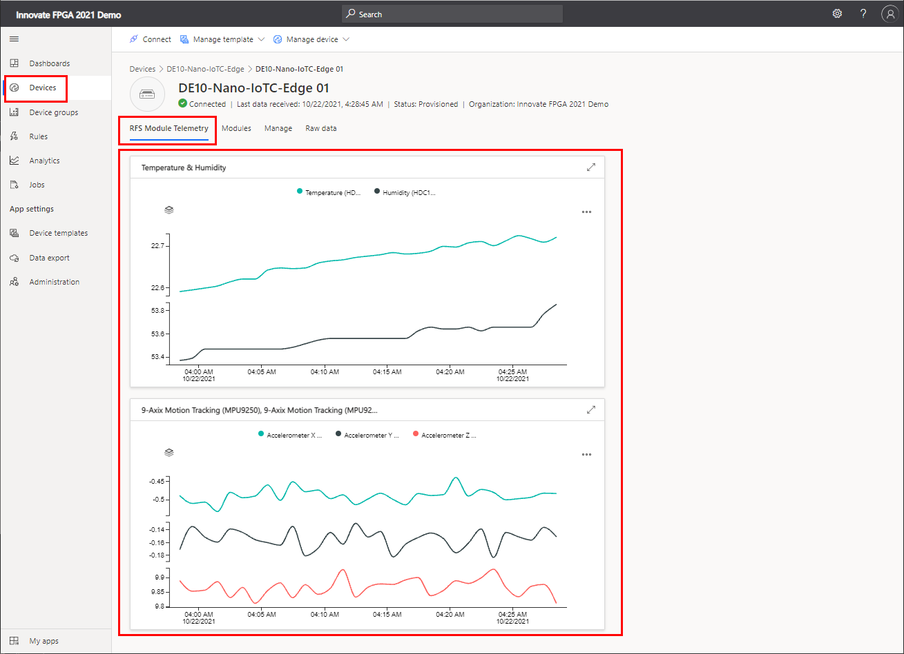

Learn more about options for **Views** at <https://docs.microsoft.com/azure/step7-iot-central/core/howto-set-up-template#views>

---
Previous Step: [Step 6: Azure IoT Module Enablement Phase](step6-azure-iot-module-enablement-phase.md)  

Tool Setup: [Prerequisites Guide](prerequisites.md)  
Learn this Design: [Sensor Aggregation Design Architecture](reference-design.md)  
Move to [Top](../top.md)
