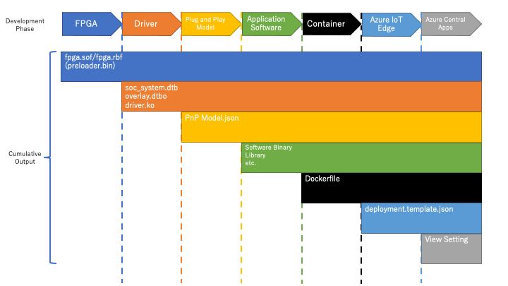

# Develop and Deploy Container Using DE10-Nano RFS Daughter card sensor

## About this tutorial

### Audience

Engineers who plan to develop for Microsoft Azure IoT on Intel® Cyclone® V SoC FPGA.
This tutorial covers the basic development workflow that includes both hardware and software.

### Objectives

In this tutorial, you will learn how to:

- Develop IoT applications for Azure IoT with Intel® Cyclone® V SoC FPGA
- Develop an FPGA design for RFS daughter card of Terasic DE10-Nano FPGA Cloud Connectivity Kit
- Compile and include the FPGA design into an Azure IoT Edge Module
- Create an Azure IoT Central application and integrate with the developed Azure IoT Edge Module
- Test for each sensor during development

## File Structures

The following is the directory structure of the tutorial including all the sample codes and their respective descriptions.

```
.
├── top.md
├── readme.md
├── docs
│   ├── prerequisites.md # How to install development tools or setup an environment
│   ├── reference-design.md # Sensor Aggregation Design Architecture Manual
│   ├── step1-fpga-development-phase.md # FPGA Development Manual
│   ├── step2-driver-development-phase.md # Driver/Device Tree Development Manual
│   ├── step3-pnp-model-development-phase.md # Plug and Play Development Manual
│   ├── step4-software-development-phase.md # Software Development Manual
│   ├── step5-container-development-phase.md # Container Development Manual
│   ├── step6-azure-iot-module-enablement-phase.md # Azure IoT Module Enablement Manual
│   └── step7-azure-iot-central-application-development-phase #Azure IoT Central Application Development Manual
│
├── hw
│   ├── Module5_Sample_HW # FPGA design, Quartus Project
│   │   ├── ip
│   │   ├── output_files
│   │   ├── prebuilt_binaries
│   │   └── software_nios2 # Nios® II software folder
│   │       ├── RFS_SENSOR # FPGA Design application project
│   │       └── RFS_SENSOR_bsp # BSP project
│   └── dtb # Device Tree Files
│       └── rfs-overlay.dts # DeviceTree Source Code
│
└── sw
    └── software-code
        ├── Dockerfile.arm32v7 # Dockerfile to run overlay and the Python application
        ├── deployment.template.json # CreateOption and PnP Setting Example for IoT Edge Module
        ├── main.py # Connecting to Azure, Getting Sensor Data, Send them to the Cloud
        ├── overlay
        │   ├── Module5_Sample_HW.rbf
        │   ├── rfs-overlay.dtbo
        │   └── run.sh
        ├── package
        │   ├── basecomnios.py # Base Communication Module with Nios® II Apps
        │   ├── gsensor.py # G-Sensor on the DE10-Nano Module
        │   ├── rfssensor.py # RFS Module for Sensors on RFS card
        │   ├── sensor.py # Template Sensor Module
        │   ├── sensorcontroller.py # Template SensorController Module for to bundle some sensors
        │   ├── threshold.py # Template Threshold Module
        │   ├── thresholdcontroller.py # Top ThresholdController Module
        │   └── utility.py # Utility Functions
        └── test
            ├── gsensor_test.py # GSensor Function Test
            ├── rfssensor_test.py # RFSSensor Function Test
            ├── sensor_test.py # A Sensor Function Test
            ├── suite_test.py # One Time Test can do all tests
            ├── test_main.sh # Environment Script as Azure Device Client
            ├── threshold_test.py # A Threshold Function Test
            └── thresholdcontroller_test.py #Threshold Function Test
```

## Summarize Development Flow

This section provides the overview for the whole development for the tutorial.
It involves a total of 7 steps staring from FPGA design and ends with Azure IoT Central Application development with integration Azure IoT Edge Module.



1. [FPGA Development](docs/step1-fpga-development-phase.md)  
    Create a Quartus® Prime Project, develop RTL code, design constraints etc... following the specification that aligns with the software design, complete the FPGA design complication and test that the circuit works as expected.
    Development tool is `Intel® Quartus® Prime Software` to compile the FPGA design project. You may use additional tools such as `Nios® II Embedded Design Suite (EDS)` and `ModelSim` as Simulator.
    This step is similar to a traditional FPGA design development.
2. [Driver Development](docs/step2-driver-development-phase.md)  
    Create/Modify device tree files to load necessary Linux kernel drivers to access the peripherals.
    If you want to use any other custom Linux kernel drivers, you will need to develop them.
    This step involves testing the necessary Linux interfaces such as `/dev` or `/sys/class`, and to execute FPGA reconfiguration using Device Tree Overlay.
    Development tool is `dtc` that is bundled in `Intel® SoC FPGA EDS`.
    This step is similar to a traditional SoC FPGA embedded application development.
3. [Plug and Play Model Development](docs/step3-pnp-model-development-phase.md)  
    Microsoft Azure IoT supports Plug and Play(PnP) and which enables solution builders to integrate IoT devices with their solutions without any manual configuration.
    This step involves defining the IoT PnP model in Device Twin Description Language (DTDLv2) format based on the available sensors through the FPGA design.
    Do take note that this PnP model may be further refined later during IoT Edge application development with additional interfaces required.
    Development Tool is `Visual Studio Code(VSCode)` with `Azure IoT Tools` extension as IDE and `dmr-client` to validate your PnP model.
4. [Software Development](docs/step4-software-development-phase.md)  
    Microsoft Azure IoT SDK supports multiple programming languages, thus you maybe choose your favorite language. This tutorial shows the development in Python language.
    This step involves developing the host application (e.g. `python3 main.py` or `./main`) and running the tests to ensure the IoT Edge application successfully connects to the FPGA design.
    Development Tools depend on programming languages used(e.g. `gcc` for C).
5. [Container Development](docs/step5-container-development-phase.md)  
    Customize a Dockerfile to use as the container specification to assemble the image and test its deployment to the device.
    This step repeats step 2 and step 3 within a containerized environment through commands like `docker run <with proper options>.`
    Development Tool is `Docker` as container building and deployment tool, and we recommend `Visual Studio Code(VSCode)` with `Azure IoT Tools` extension as IDE.
6. [Azure IoT Edge Enablement](docs/step6-azure-iot-module-enablement-phase.md)
    Connects and deploy Azure IoT Edge module with the Docker image from previous step.
    This step involves configuring and deploying the Azure IoT Edge module to the device and ensure it works through Azure IoT Edge deployment.
    Development Tool is `Visual Studio Code(VSCode)` with `Azure IoT Tools` extension as IDE.
7. (Optional) [Azure Central Application Development](docs/step7-azure-iot-central-application-development-phase.md)  
    This last step is optional, where it involves creation of an Azure IoT Central application to allow easy dashboard creation for IoT device monitoring. 
    This step involves configuring the Azure IoT Central application for PnP models, adjusting views for the application and connecting the IoT device to it.
    Development Tool is any web browser capable of connecting and browsing `Azure IoT Central`.

If you encounter any functional failures or deviation from the expected test results, please revisit the previous step for issue isolation.

---
Next Step : [Step 1: FPGA Development Phase](docs/step1-fpga-development-phase.md)  
Tool Setup: [Prerequisites Guide](docs/prerequisites.md)  
Learn this Design: [Sensor Aggregation Design Architecture](docs/reference-design.md)  


## Security Considerations:
FPGA design examples from this tutorial and Intel® FPGA IPs may not meet your security requirements. You shall conduct a security review of your design including both hardware and software piece to ensure it meets your security requirements.

Here's a list of general guidelines with respect to security for solution design that involves both hardware and software development:
1. Documentation for all IP cores used shall be reviewed for any security concerns. 
2. Remove any JTAG interface from the final designs.
3. Control access to areas of memory to prevent unauthorized transactions or corruption by other IPs in the design. 
4. Ensure correct configuration of the IP via the control interface and user input data is valid.
5. Protect the bitstreams for your design using the built-in security features from Intel® Quartus® Prime.
6. Enable password protection for the design’s ARM* processor.
7. Protect access to the design through hardware ports.
8. Restrict debugging access by tools such as Signal Tap.
9. Encrypt information on SD cards, FPGA bitstreams, and DDR memory devices.
10. Apply security features to any user data in storage, such as SD card.
11. Consider using encryption schemes enable secure data communication.
12. Consider the boot sequence and boot security aspects of the design.
13. Implement Intel® FPGA bitstream encryption technology to further protect the FPGA design content of the products. For information on Intel® FPGA bitstream encryption technology, refer to [Using the Design Security Features in Intel® FPGAs](https://www.intel.com/content/dam/www/programmable/us/en/pdfs/literature/an/an556.pdf).
14. Restrict access from unauthorized personnel to the system hosting the FPGA designs (physical as well as remote access). Authentication of accesses to the system (including Linux) shall be put in place.
15. Review the security aspects on the Azure IoT Edge including cloud communications, device provisioning etc... following guidelines from Microsoft Azure, refer to [Security standards for Azure IoT Edge](https://docs.microsoft.com/en-us/azure/iot-edge/security)
