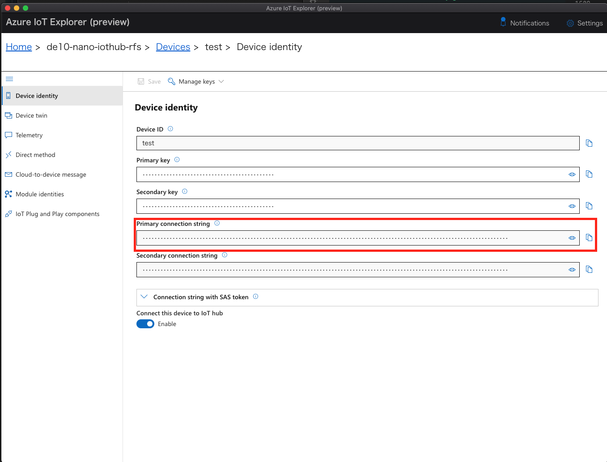
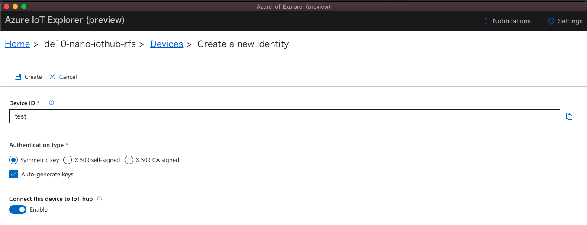

# Prerequisites

+ Ubuntu 18.04 Image for DE10-Nano FPGA Cloud Connectivity Kit
<http://download.terasic.com/downloads/cd-rom/de10-nano/AzureImage/DE10-Nano-Cloud-Native_18.04.zip>

> [!Note]  
> This image preinstalled Python3.7 and iotedge v1.2.4.

+ Reference Documentations
    + [Quick Started][LINK_InnovateFPGA_Tutorial]  
    This documentation covers usage of Microsoft Azure Resource Manager for IoT device deployment.
    > [!WARNING]
    > We have a report with some SD cards you may see SD card access error in console.  
    > We are investigating this issue.
    > In the meantime, please try with a bigger SD card (16GB or bigger).  We have only seen this error with some 8GB SD cards.
    > If you experience this issue, please report to your Innovate FPGA contact.  
    > Reference: <https://github.com/terasic/InnovateFPGA2021/blob/main/docs/PaaS-Provision.md>


    + [Build an Azure* Container-based Application using Visual Studio Code][LINK_Build_an_Azure_Container-based_Application_using_Visual_Studio_Code]  
    This tutorial covers the basic development of Azure IoT Edge Container-based application.
    
    + [Reconfigure an FPGA from the Azure* Cloud using a Container Application][LINK_Develop_and_Deploy_Container_Reconfiguring_FPGA_Circuit_of_DE10-Nano_from_Azure_Cloud]  
    This tutorial covers the basic development of Azure IoT Edge Container-based application to reconfigure an FPGA.

+ Source Codes hosted at GitHub
    ```
    git clone https://github.com/intel-iot-devkit/terasic-de10-nano-kit
    ```
    This repository contains other tutorials as well, for this specific tutorial we are going to use source codes in `azure-de10nano-document/sensor-aggregation-reference-design-for-azure`

+ Access to IP address of DE10-Nano

    To retrieve the IP Address, open your DE10-Nano console and get the DE10-Nano IP address.
   
    Input:
    ```
    ip addr
    ```

    Output:
    ```
    2: eth0: <BROADCAST,MULTICAST,UP,LOWER_UP> mtu 1500 qdisc mq state UP group default qlen 1000
        link/ether f2:36:44:ac:08:7b brd ff:ff:ff:ff:ff:ff
        inet 192.168.100.145/24 brd 192.168.100.255 scope global dynamic eth0
        valid_lft 600184sec preferred_lft 600184sec
    ```
    In this case, the address is "192.168.100.145".

+ Additional development tools for carrying out this tutorial
    + FPGA Development
        + Quartus® Prime Software Lite/Standard Edition version 20.1.1
        + Nios® II Embedded Design Suite(EDS) 

    + Driver Development
        + Intel® SoC FPGA Embedded Development Suite (SoC EDS) Standard Edition version 20.1 

    + Software Development
        + Visual Studio Code (VSCode)
            Recommended IDE and installation is already covered in [the document][LINK_Build_an_Azure_Container-based_Application_using_Visual_Studio_Code].
        + dmr-client
            Simple tool to validate Plug and Play(PnP) models. Follow [Installation document][LINK_Dmr_Client_Installation]
        + Python 3.7 in DE10-Nano  
            This tutorial uses Python, Python 3.7 in specific as the development language
        + Azure IoT Explorer in Development PC
            Azure IoT Explorer is a graphical tool for interacting with and testing your IoT Plug and Play devices.
        + Azure Services
            + Azure Container Registry(ACR)
            + Azure IoT Edge
            + Azure IoT Central

## Install Python3.7
Python 3.7 is not installed on Ubuntu 18.04 by default. By using the PPA, you can install it directly.
Alternatively, you can install through pyenv.

In addition, please install pip for Python 3.7 as well.
```
sudo apt install -y python3.7 python3.7-dev
python3.7 get-pip.py
```

## Install Azure IoT Explorer
Follow [Azure IoT Explorer Installation Guide][LINK_Install_Azure_IoT_Explorer] to install the latest version available.
This tutorial is verified with version 0.14.5.

After Azure IoT Explorer, Click `Add connection` and paste IoT Hub connection string.
You can get this string from VS Code to click `...` in `AZURE IOT HUB` panel on the left bottom and `Copy IoT Hub Connection String`.




When IoT Hub connection is successful, you will see all the devices registered under the IoT Hub.
It is recommended to create a new device for native tests.
```
Device ID: test
```



---
Next Step : [Step 1: FPGA Development Phase](step1-fpga-development-phase.md)  
Learn this Design: [Sensor Aggregation Design Architecture](reference-design.md)  

Move to [Top](../top.md)


[LINK_InnovateFPGA_Tutorial]:https://github.com/terasic/InnovateFPGA2021
[LINK_INTEL_REPO_in_GITHUB]:https://github.com/intel-iot-devkit/terasic-de10-nano-kit
[LINK_Build_an_Azure_Container-based_Application_using_Visual_Studio_Code]: https://software.intel.com/content/www/us/en/develop/articles/build-an-azure-container-based-application-using-visual-studio.html
[LINK_Develop_and_Deploy_Container_Reconfiguring_FPGA_Circuit_of_DE10-Nano_from_Azure_Cloud]: https://software.intel.com/content/www/us/en/develop/articles/reconfigure-an-fpga-from-the-cloud-with-containers.html
[LINK_Dmr_Client_Installation]: https://docs.microsoft.com/en-us/azure/iot-develop/concepts-model-repository#dmr-client-tools
[LINK_Install_Azure_IoT_Explorer]: https://docs.microsoft.com/en-us/azure/iot-fundamentals/howto-use-iot-explorer