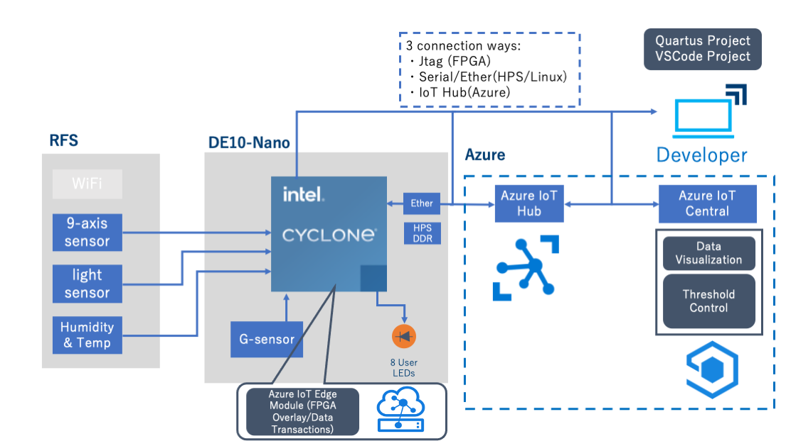
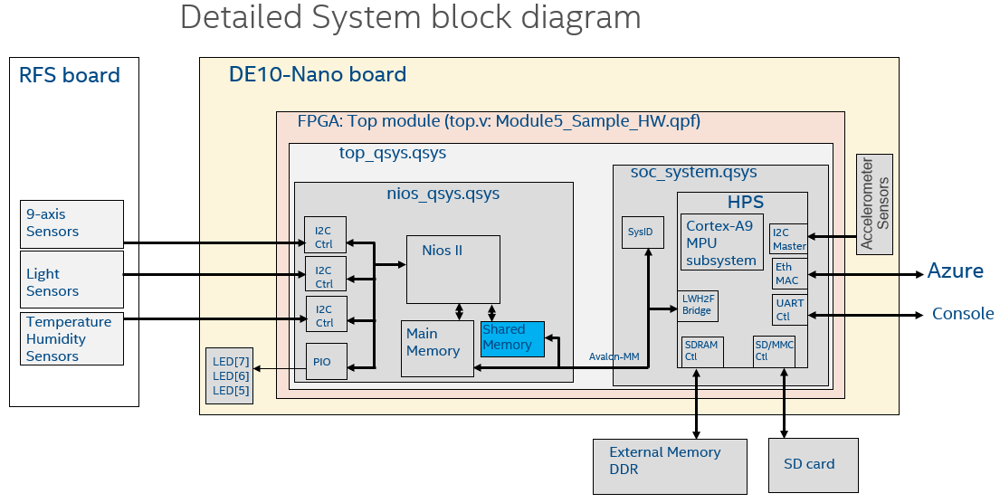

# Reference Design Architecture
This section explains the overall solution design architecture.

## Block Diagram

This is the architecture of this design.

This design contains five functions:
+ Getting the sensor data
+ Sending the sensor data to Azure IoT Hub
+ Setting thresholds for the sensor data
+ Controlling the thresholds from Azure IoT Hub
+ Turn on specific LED when the data is beyond the specified threshold
  + LED[7]: Any of 9-axis sensors
  + LED[6]: Humidity or Temperature sensors
  + LED[5]: Light sensors

Communication with Azure is done through Azure IoT Edge software stack on Host Processor Subsystem (HPS), and accessing sensors and LEDs are done by FPGA design.

Multiple debug method are available different portions of this reference design.
+ JTAG for debugging FPGA design
+ Serial or Ethernet for debugging drivers/software on HPS
+ IoT Hub for debugging Azure IoT Edge Module

## Detailed System Design with FPGA and HPS

This is a detailed block diagram showing various interfaces between multiple function blocks of DE10-Nano.

There are two Platform Designer designs within the top_qsys system in the FPGA design:

- **soc_system.qsys :** This is an HPS design based on DE10_NANO_SoC_GHRD project of Terasic reference design. IoT Edge runs on the HPS as an FPGA Component IP.
- **nios_qsys.qsys :** This is a Nios® II embedded processor design based on DE10_NANO_RFS_SENSOR project of Terasic reference design. Shared Memory is added in this system, and can be accessed by both the HPS and the Nios® II embedded processor. The Nios® II embedded processor reads the sensor data from RFS card and writes sensor values to the Shared Memory every 100 ms. The HPS will read from the Shared Memory for the sensor values in its own arbitrary timing.

*NOTE :* To keep the design simple, this FPGA design does not include a frame buffer for HDMI display. After you've reconfigured the FPGA with this new design, there will be no output from HDMI port anymore. 

---
Tool Setup: [Prerequisites Guide](prerequisites.md)  
Move to [Top](../top.md)

## Security Considerations:
FPGA design examples from this tutorial and Intel® FPGA IPs may not meet your security requirements. You shall conduct a security review of your design including both hardware and software piece to ensure it meets your security requirements.

Here's a list of general guidelines with respect to security for solution design that involves both hardware and software development:
1. Documentation for all IP cores used shall be reviewed for any security concerns. 
2. Remove any JTAG interface from the final designs.
3. Control access to areas of memory to prevent unauthorized transactions or corruption by other IPs in the design. 
4. Ensure correct configuration of the IP via the control interface and user input data is valid.
5. Protect the bitstreams for your design using the built-in security features from Intel® Quartus® Prime.
6. Enable password protection for the design’s ARM* processor.
7. Protect access to the design through hardware ports.
8. Restrict debugging access by tools such as Signal Tap.
9. Encrypt information on SD cards, FPGA bitstreams, and DDR memory devices.
10. Apply security features to any user data in storage, such as SD card.
11. Consider using encryption schemes enable secure data communication.
12. Consider the boot sequence and boot security aspects of the design.
13. Implement Intel® FPGA bitstream encryption technology to further protect the FPGA design content of the products. For information on Intel® FPGA bitstream encryption technology, refer to [Using the Design Security Features in Intel® FPGAs](https://www.intel.com/content/dam/www/programmable/us/en/pdfs/literature/an/an556.pdf).
14. Restrict access from unauthorized personnel to the system hosting the FPGA designs (physical as well as remote access). Authentication of accesses to the system (including Linux) shall be put in place.
15. Review the security aspects on the Azure IoT Edge including cloud communications, device provisioning etc... following guidelines from Microsoft Azure, refer to [Security standards for Azure IoT Edge](https://docs.microsoft.com/en-us/azure/iot-edge/security)