# Step 4: Device Application Development Phase

## Goals

The goals for this step are :

- Validate communication with FPGA resources via shared memory by
  - Reading sensor data from RFS card
  - Setting thresholds to Nios® II
- Validate connection to Azure IoT Hub from Python application
  - Successful telemetry delivery to Azure IoT Hub
- View device data with IoT Plug and Play model

> [!NOTE]  
> The reference application is written in Python, verified with Python 3.7.7.  
> The main source code file is `main.py`.  
> If you prefer to develop in a different programming language (e.g. ANSI C or .NET), please choose the correct programming language when creating the new VSCode project.

## Step 4.1: Preparation

You can choose to develop the code on development machine or DE10-Nano. There is difference on performing the required tasks, thus please configure environment appropriately.
For example, compiling the device application written in C is better on development machine since C compilation is CPU-intensive workload.
If you are writing an application in Python and deploy with containerization, do consider building the container image on development machine that has bigger storage capacity.

Besides, these are several additional options to consider :

- Development environment: 
  Generally speaking, running CPU intensive workloads such as compiling C source code with gcc on more powerful development machine is preferred.

- IDE : 
  For productivity, development machine with a bigger screen is preferred than running text editor on DE10-Nano

- Copying executables and binaries : 
  Compiled binary file(s) needs to be copied to DE10-Nano for testing and execution. Please consider setting up remote access for tools such as SCP.

Here's our suggested development environment workflow and setup:

- Development Machine : Running Windows, macOS, or Linux with internet access
  - VSCode as IDE
  - Tools are installed on your development machine

- DE10-Nano : Test & Execution environment
  - Network-accessible from your development machine
  - Libraries, packages, and tools are installed to run the Python reference application

- Source Code
  - Use source code on DE10-Nano to run Python application directly with no compilation required
  - Use source code on your development machine to customize and create container image

### Step 4.1.1: Summary of Tools and Resources

List of tools and required resources used in this step

- Azure Subscription  
  - Azure IoT Hub

- Development Machine
  - VSCode with following extensions installed
    - [Remote SSH extension](https://marketplace.visualstudio.com/items?itemName=ms-vscode-remote.remote-ssh)
    - [Azure IoT Hub Extension](https://marketplace.visualstudio.com/items?itemName=vsciot-vscode.azure-iot-toolkit)
  - [Azure IoT Explorer](prerequisites.md#install-azure-iot-explorer) 
  - Git client (GUI or CLI)

- DE10-Nano
  - [Python 3.7 and PIP](prerequisites.md#install-python37)
  - GIT client (CLI)  
    Install GIT Client CLI with :

    ```bash
    sudo apt install -y git
    ```

### Step 4.1.2: Connecting to DE10-Nano from VSCode over SSH

1. Follow [the step-by-step tutorial](https://code.visualstudio.com/docs/remote/ssh-tutorial) to configure Remote SSH between VSCode running on your development machine and DE10-Nano.

  > [!TIP]  
  > Setting [static IP address](https://github.com/terasic/InnovateFPGA2021/blob/main/docs/DE10-Nano-Setup.md#option-static-ip) for DE10-Nano and configuring [SSH Key authentication](https://code.visualstudio.com/docs/remote/troubleshooting#_quick-start-using-ssh-keys) are highly recommended

2. Open VSCode on your development machine
3. Click `><` icon on the bottom left of VSCode to open `Remote-SSH` menu

    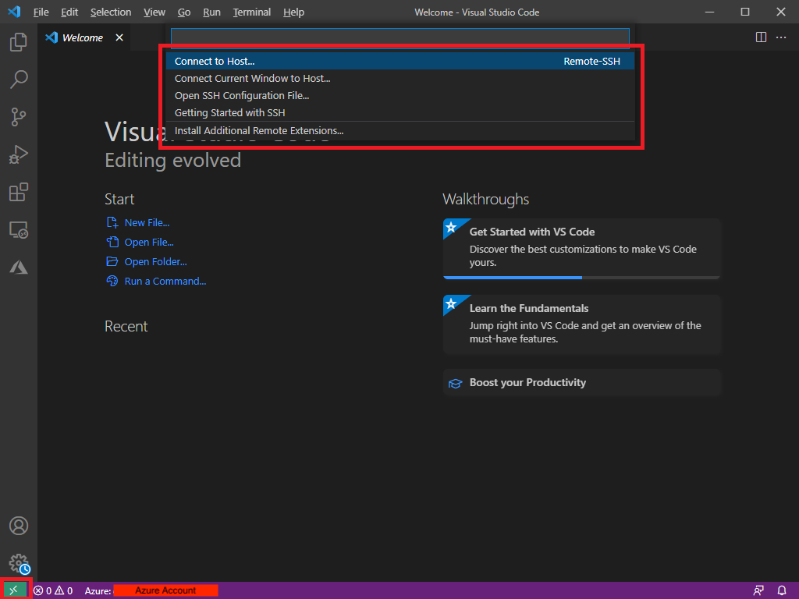

4. Click on `Connect to Host`
5. Type `<username>@<IP Address of DE10-Nano>`

    By default, it should be `root@<ipaddres>`

    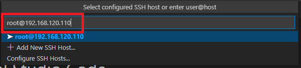

6. Enter password (Default is `de10nano`) when prompted

### Step 4.1.3: Clone the Reference Application and open in VSCode

Clone the reference application source code from the GitHub to DE10-Nano :

> [!TIP]
> If you plan to develop your own application based on the reference application, consider forking the repo for better source code management.

1. Open a new Terminal in VSCode.
   
   `Terminal` menu -> `New Terminal`. A new terminal window will be opened at the bottom of VSCode
2. Clone repo with :

    ```bash
    git clone https://github.com/intel-iot-devkit/terasic-de10-nano-kit.git
    ```

    This will clone the reference application repository from GitHub to DE10-Nano's local filesystem at `~/terasic-de10-nano-kit`.

3. Open the reference application source code with VSCode

    `File` menu -> `Open Folder`, then browse to `~/terasic-de10-nano-kit/azure-de10nano-document/sensor-aggregation-reference-design-for-azure/sw/software-code`

4. Confirm the source code is opened in VSCode as a VSCode project under the `Explorer` pane.

    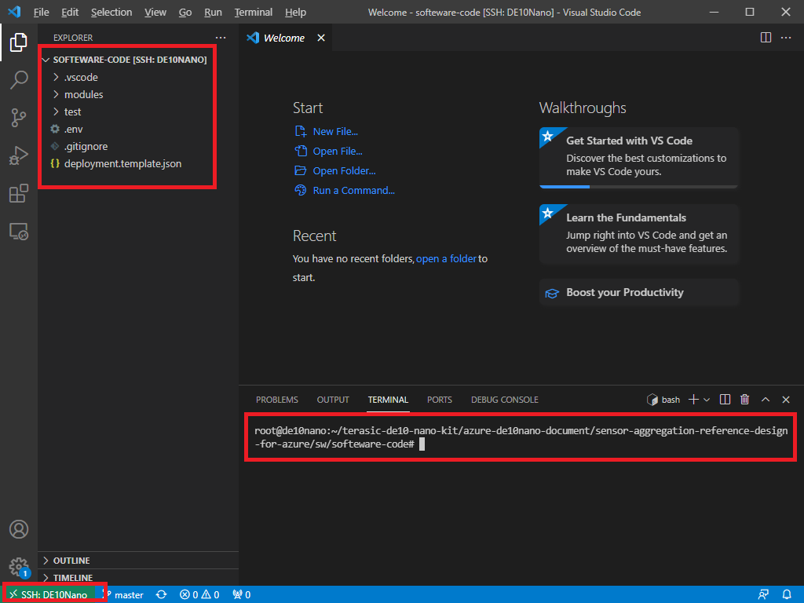

## Step 4.2: Run Unit Test to test communication with FPGA resources

Unit tests cover the following :

- Reads gSensor data
- Communicates to Nios® II firmware to get RFS data and control threshold data.
- Creates simulated data to send to Azure IoT Hub
- Tests base/virtual class

Reading RFS sensor data is based on rfs-sensor application written in C language provided by Terasic.

1. Make sure default overlay is disabled : [Instruction](#disable-services-accessing-fpga)
2. Open a new terminal in VSCode
3. Navigate to `RfsModule` folder in VSCode's remote terminal with :

    ```bash
    cd ~/terasic-de10-nano-kit/azure-de10nano-document/sensor-aggregation-reference-design-for-azure/sw/software-code/modules/RfsModule
    ```

4. Install Python Package using Pip with :

    ```bash
    python3.7 -m pip install -r ./requirements.txt 
    ```

5. Reconfigure FPGA through Device Tree overlay with :

    ```bash
    cd ./overlay
    ./overlay.sh
    ```

6. Run the unit test with :

    ```bash
    cd ../test
    python3.7 suite_test.py
    ```

    <details><summary> Sample Output : </summary>

    ```bash
    root@de10nano:~/rfs-test# python3.8 suite_test.py
    gSensor sensor is dummy and if you want values to test, please use generate_dummy_value in threshold class.
    {'gSensor': {'x': 0.028, 'y': 0.028, 'z': 1.0}}
    .
                        RfsSensors:
                            Lux :
                                Data : 0x40108
                            Humidity :
                                Data : 0x4010c
                            Temperature :
                                Data : 0x40110
                            AX :
                                Data : 0x40114
                            AY :
                                Data : 0x40118
                            AZ :
                                Data : 0x4011c
                            GX :
                                Data : 0x40120
                            GY :
                                Data : 0x40124
                            GZ :
                                Data : 0x40128
                            MX :
                                Data : 0x4012c
                            MY :
                                Data : 0x40130
                            MZ :
                                Data : 0x40134

    lux sensor is dummy and if you want values to test, please use generate_dummy_value in threshold class.
    humidity sensor is dummy and if you want values to test, please use generate_dummy_value in threshold class.
    temperature sensor is dummy and if you want values to test, please use generate_dummy_value in threshold class.
    ax sensor is dummy and if you want values to test, please use generate_dummy_value in threshold class.
    ay sensor is dummy and if you want values to test, please use generate_dummy_value in threshold class.
    az sensor is dummy and if you want values to test, please use generate_dummy_value in threshold class.
    gx sensor is dummy and if you want values to test, please use generate_dummy_value in threshold class.
    gy sensor is dummy and if you want values to test, please use generate_dummy_value in threshold class.
    gz sensor is dummy and if you want values to test, please use generate_dummy_value in threshold class.
    mx sensor is dummy and if you want values to test, please use generate_dummy_value in threshold class.
    my sensor is dummy and if you want values to test, please use generate_dummy_value in threshold class.
    mz sensor is dummy and if you want values to test, please use generate_dummy_value in threshold class.
    {'lux': 0.007799999788403511, 'humidity': 45.66650390625, 'temperature': 28.87418556213379, 'mpu9250': {'ax': -4.371812343597412, 'ay': -0.4692635238170624, 'az': 8.911218643188477, 'gx': -0.02766985446214676, 'gy': 0.012770702131092548, 'gz': 0.02766985446214676, 'mx': 19.30078125, 'my': 57.01640701293945, 'mz': 8.642578125}}
    .
                        RfsSensors:
                            Lux :
                                Data : 0x40108
                            Humidity :
                                Data : 0x4010c
                            Temperature :
                                Data : 0x40110
                            AX :
                                Data : 0x40114
                            AY :
                                Data : 0x40118
                            AZ :
                                Data : 0x4011c
                            GX :
                                Data : 0x40120
                            GY :
                                Data : 0x40124
                            GZ :
                                Data : 0x40128
                            MX :
                                Data : 0x4012c
                            MY :
                                Data : 0x40130
                            MZ :
                                Data : 0x40134

    lux sensor is dummy and if you want values to test, please use generate_dummy_value in threshold class.
    humidity sensor is dummy and if you want values to test, please use generate_dummy_value in threshold class.
    temperature sensor is dummy and if you want values to test, please use generate_dummy_value in threshold class.
    ax sensor is dummy and if you want values to test, please use generate_dummy_value in threshold class.
    ay sensor is dummy and if you want values to test, please use generate_dummy_value in threshold class.
    az sensor is dummy and if you want values to test, please use generate_dummy_value in threshold class.
    gx sensor is dummy and if you want values to test, please use generate_dummy_value in threshold class.
    gy sensor is dummy and if you want values to test, please use generate_dummy_value in threshold class.
    gz sensor is dummy and if you want values to test, please use generate_dummy_value in threshold class.
    mx sensor is dummy and if you want values to test, please use generate_dummy_value in threshold class.
    my sensor is dummy and if you want values to test, please use generate_dummy_value in threshold class.
    mz sensor is dummy and if you want values to test, please use generate_dummy_value in threshold class.
    {"mpu9250": {}} utf-8 application/json
    {"lux": 0.007799999788403511, "humidity": 45.66650390625, "temperature": 28.87418556213379, "mpu9250": {"ax": -4.371812343597412, "ay": -0.4692635238170624, "az": 8.911218643188477, "gx": -0.02766985446214676, "gy": 0.012770702131092548, "gz": 0.02766985446214676, "mx": 19.30078125, "my": 57.01640701293945, "mz": 8.642578125}} utf-8 application/json
    .
                        RfsSensors:
                            Lux :
                                Data : 0x40108
                            Humidity :
                                Data : 0x4010c
                            Temperature :
                                Data : 0x40110
                            AX :
                                Data : 0x40114
                            AY :
                                Data : 0x40118
                            AZ :
                                Data : 0x4011c
                            GX :
                                Data : 0x40120
                            GY :
                                Data : 0x40124
                            GZ :
                                Data : 0x40128
                            MX :
                                Data : 0x4012c
                            MY :
                                Data : 0x40130
                            MZ :
                                Data : 0x40134

    lux sensor is dummy and if you want values to test, please use generate_dummy_value in threshold class.
    humidity sensor is dummy and if you want values to test, please use generate_dummy_value in threshold class.
    temperature sensor is dummy and if you want values to test, please use generate_dummy_value in threshold class.
    ax sensor is dummy and if you want values to test, please use generate_dummy_value in threshold class.
    ay sensor is dummy and if you want values to test, please use generate_dummy_value in threshold class.
    az sensor is dummy and if you want values to test, please use generate_dummy_value in threshold class.
    gx sensor is dummy and if you want values to test, please use generate_dummy_value in threshold class.
    gy sensor is dummy and if you want values to test, please use generate_dummy_value in threshold class.
    gz sensor is dummy and if you want values to test, please use generate_dummy_value in threshold class.
    mx sensor is dummy and if you want values to test, please use generate_dummy_value in threshold class.
    my sensor is dummy and if you want values to test, please use generate_dummy_value in threshold class.
    mz sensor is dummy and if you want values to test, please use generate_dummy_value in threshold class.
    {"mpu9250": {}} utf-8 application/json Dummy
    {"lux": 0.007799999788403511, "humidity": 45.66650390625, "temperature": 28.87418556213379, "mpu9250": {"ax": -4.371812343597412, "ay": -0.4692635238170624, "az": 8.911218643188477, "gx": -0.02766985446214676, "gy": 0.012770702131092548, "gz": 0.02766985446214676, "mx": 19.30078125, "my": 57.01640701293945, "mz": 8.642578125}} utf-8 application/json RfsSensor
    .Dummy sensor is dummy and if you want values to test, please use generate_dummy_value in threshold class.
    .New lux's Threshold is 0.0 - 1000.0
    This Return Value of Dummy's min will be just stored value in the application.
    This Return Value of Dummy's max will be just stored value in the application.
    New Dummy's Threshold is 4.0 - 10.0
    New lux's Threshold is 4.0 - 10.0
    .New lux's Threshold is 0.0 - 1000.0
    Error::: key(Test) is undefined
    This Return Value of Dummy's min will be just stored value in the application.
    This Return Value of Dummy's max will be just stored value in the application.
    New lux's Threshold is 4.0 - 10.0
    Error::: key(Test) is undefined
    .New lux's Threshold is 0.0 - 1000.0
    1st value is 333.5258169394502, and 2nd value is 488.4552338259124
    .New lux's Threshold is 0.0 - 1000.0
    This Return Value of Dummy's min will be just stored value in the application.
    This Return Value of Dummy's max will be just stored value in the application.
    New Dummy's Threshold is 4.0 - 10.0
    This Return Value of Dummy's min will be just stored value in the application.
    This Return Value of Dummy's max will be just stored value in the application.
    New lux's Threshold is 4.0 - 10.0
    .New lux's Threshold is 0.0 - 1000.0
    New humidity's Threshold is 0.0 - 49.900001525878906
    New temperature's Threshold is 0.0 - 42.29999923706055
    New ax's Threshold is -100.0 - 100.0
    New ay's Threshold is -100.0 - 100.0
    New az's Threshold is -100.0 - 100.0
    New gx's Threshold is -10.0 - 10.0
    New gy's Threshold is -10.0 - 10.0
    New gz's Threshold is -10.0 - 10.0
    New mx's Threshold is -100.0 - 100.0
    New my's Threshold is -100.0 - 100.0
    New mz's Threshold is -100.0 - 100.0

                        ThresholdController:
                            X(Dummy) :
                                Min  : 0x0 Max  : 0x0
                            Y(Dummy) :
                                Min  : 0x0 Max  : 0x0
                            Z(Dummy) :
                                Min  : 0x0 Max  : 0x0
                            lux :
                                Min  : 0x40210 Max  : 0x40214
                            humidity :
                                Min  : 0x40218 Max  : 0x4021c
                            temperature :
                                Min  : 0x40220 Max  : 0x40224
                            ax :
                                Min  : 0x40228 Max  : 0x4022c
                            ay :
                                Min  : 0x40230 Max  : 0x40234
                            az :
                                Min  : 0x40238 Max  : 0x4023c
                            gx :
                                Min  : 0x40240 Max  : 0x40244
                            gy :
                                Min  : 0x40248 Max  : 0x4024c
                            gz :
                                Min  : 0x40250 Max  : 0x40254
                            mx :
                                Min  : 0x40258 Max  : 0x4025c
                            my :
                                Min  : 0x40260 Max  : 0x40264
                            mz :
                                Min  : 0x40268 Max  : 0x4026c

    Error::: key(Test) is undefined
    This Return Value of X's min will be just stored value in the application.
    X-min value is 0
    This Return Value of X's max will be just stored value in the application.
    X-max value is 10
    Error::: key(Test) is undefined
    This Return Value of Y's min will be just stored value in the application.
    Y-min value is 0
    This Return Value of Y's max will be just stored value in the application.
    Y-max value is 10
    Error::: key(Test) is undefined
    This Return Value of Z's min will be just stored value in the application.
    Z-min value is 0
    This Return Value of Z's max will be just stored value in the application.
    Z-max value is 10
    Error::: key(Test) is undefined
    This Return Value of lux's min will be just stored value in the application.
    lux-min value is 0
    This Return Value of lux's max will be just stored value in the application.
    lux-max value is 1000
    Error::: key(Test) is undefined
    This Return Value of humidity's min will be just stored value in the application.
    humidity-min value is 0
    This Return Value of humidity's max will be just stored value in the application.
    humidity-max value is 49.9
    Error::: key(Test) is undefined
    This Return Value of temperature's min will be just stored value in the application.
    temperature-min value is 0
    This Return Value of temperature's max will be just stored value in the application.
    temperature-max value is 42.3
    Error::: key(Test) is undefined
    This Return Value of ax's min will be just stored value in the application.
    ax-min value is -100
    This Return Value of ax's max will be just stored value in the application.
    ax-max value is 100
    Error::: key(Test) is undefined
    This Return Value of ay's min will be just stored value in the application.
    ay-min value is -100
    This Return Value of ay's max will be just stored value in the application.
    ay-max value is 100
    Error::: key(Test) is undefined
    This Return Value of az's min will be just stored value in the application.
    az-min value is -100
    This Return Value of az's max will be just stored value in the application.
    az-max value is 100
    Error::: key(Test) is undefined
    This Return Value of gx's min will be just stored value in the application.
    gx-min value is -10
    This Return Value of gx's max will be just stored value in the application.
    gx-max value is 10
    Error::: key(Test) is undefined
    This Return Value of gy's min will be just stored value in the application.
    gy-min value is -10
    This Return Value of gy's max will be just stored value in the application.
    gy-max value is 10
    Error::: key(Test) is undefined
    This Return Value of gz's min will be just stored value in the application.
    gz-min value is -10
    This Return Value of gz's max will be just stored value in the application.
    gz-max value is 10
    Error::: key(Test) is undefined
    This Return Value of mx's min will be just stored value in the application.
    mx-min value is -100
    This Return Value of mx's max will be just stored value in the application.
    mx-max value is 100
    Error::: key(Test) is undefined
    This Return Value of my's min will be just stored value in the application.
    my-min value is -100
    This Return Value of my's max will be just stored value in the application.
    my-max value is 100
    Error::: key(Test) is undefined
    This Return Value of mz's min will be just stored value in the application.
    mz-min value is -100
    This Return Value of mz's max will be just stored value in the application.
    mz-max value is 100
    Error::: key(Test) is undefined
    This Return Value of X's min will be just stored value in the application.
    X-min value is 0
    This Return Value of X's max will be just stored value in the application.
    X-max value is 10
    Error::: key(Test) is undefined
    This Return Value of Y's min will be just stored value in the application.
    Y-min value is 0
    This Return Value of Y's max will be just stored value in the application.
    Y-max value is 10
    Error::: key(Test) is undefined
    This Return Value of Z's min will be just stored value in the application.
    Z-min value is 0
    This Return Value of Z's max will be just stored value in the application.
    Z-max value is 10
    Error::: key(Test) is undefined
    lux-min value is 0.0
    lux-max value is 1000.0
    Error::: key(Test) is undefined
    humidity-min value is 0.0
    humidity-max value is 49.900001525878906
    Error::: key(Test) is undefined
    temperature-min value is 0.0
    temperature-max value is 42.29999923706055
    Error::: key(Test) is undefined
    ax-min value is -100.0
    ax-max value is 100.0
    Error::: key(Test) is undefined
    ay-min value is -100.0
    ay-max value is 100.0
    Error::: key(Test) is undefined
    az-min value is -100.0
    az-max value is 100.0
    Error::: key(Test) is undefined
    gx-min value is -10.0
    gx-max value is 10.0
    Error::: key(Test) is undefined
    gy-min value is -10.0
    gy-max value is 10.0
    Error::: key(Test) is undefined
    gz-min value is -10.0
    gz-max value is 10.0
    Error::: key(Test) is undefined
    mx-min value is -100.0
    mx-max value is 100.0
    Error::: key(Test) is undefined
    my-min value is -100.0
    my-max value is 100.0
    Error::: key(Test) is undefined
    mz-min value is -100.0
    mz-max value is 100.0
    .New lux's Threshold is 0.0 - 1000.0
    New humidity's Threshold is 0.0 - 49.900001525878906
    New temperature's Threshold is 0.0 - 42.29999923706055
    New ax's Threshold is -100.0 - 100.0
    New ay's Threshold is -100.0 - 100.0
    New az's Threshold is -100.0 - 100.0
    New gx's Threshold is -10.0 - 10.0
    New gy's Threshold is -10.0 - 10.0
    New gz's Threshold is -10.0 - 10.0
    New mx's Threshold is -100.0 - 100.0
    New my's Threshold is -100.0 - 100.0
    New mz's Threshold is -100.0 - 100.0

                        ThresholdController:
                            X(Dummy) :
                                Min  : 0x0 Max  : 0x0
                            Y(Dummy) :
                                Min  : 0x0 Max  : 0x0
                            Z(Dummy) :
                                Min  : 0x0 Max  : 0x0
                            lux :
                                Min  : 0x40210 Max  : 0x40214
                            humidity :
                                Min  : 0x40218 Max  : 0x4021c
                            temperature :
                                Min  : 0x40220 Max  : 0x40224
                            ax :
                                Min  : 0x40228 Max  : 0x4022c
                            ay :
                                Min  : 0x40230 Max  : 0x40234
                            az :
                                Min  : 0x40238 Max  : 0x4023c
                            gx :
                                Min  : 0x40240 Max  : 0x40244
                            gy :
                                Min  : 0x40248 Max  : 0x4024c
                            gz :
                                Min  : 0x40250 Max  : 0x40254
                            mx :
                                Min  : 0x40258 Max  : 0x4025c
                            my :
                                Min  : 0x40260 Max  : 0x40264
                            mz :
                                Min  : 0x40268 Max  : 0x4026c

    X dummy value is 6.708421234054893(1st), 7.3477344468853(2nd)
    Y dummy value is 7.679967388874974(1st), 9.795438838692546(2nd)
    Z dummy value is 7.42332117837114(1st), 9.84380020917142(2nd)
    lux dummy value is 919.0334851453805(1st), 81.77502817251892(2nd)
    humidity dummy value is 49.42408252147659(1st), 39.0538476333806(2nd)
    temperature dummy value is 37.89091118840756(1st), 16.556988945786305(2nd)
    ax dummy value is 4.697818847209362(1st), 65.79958058361777(2nd)
    ay dummy value is 2.263630167531332(1st), -55.4862393491816(2nd)
    az dummy value is 42.39258115016179(1st), 25.38751614442127(2nd)
    gx dummy value is 3.6598598335196364(1st), -8.560279732953315(2nd)
    gy dummy value is 3.4056155121864506(1st), -2.9418591182347154(2nd)
    gz dummy value is -5.389393113819523(1st), 5.657077300474265(2nd)
    mx dummy value is 18.65098712013942(1st), -94.71363461349969(2nd)
    my dummy value is 11.436335368783233(1st), 92.27889538319073(2nd)
    mz dummy value is 8.052846623342333(1st), 4.642791857863202(2nd)
    .New lux's Threshold is 0.0 - 1000.0
    New humidity's Threshold is 0.0 - 49.900001525878906
    New temperature's Threshold is 0.0 - 42.29999923706055
    New ax's Threshold is -100.0 - 100.0
    New ay's Threshold is -100.0 - 100.0
    New az's Threshold is -100.0 - 100.0
    New gx's Threshold is -10.0 - 10.0
    New gy's Threshold is -10.0 - 10.0
    New gz's Threshold is -10.0 - 10.0
    New mx's Threshold is -100.0 - 100.0
    New my's Threshold is -100.0 - 100.0
    New mz's Threshold is -100.0 - 100.0

                        ThresholdController:
                            X(Dummy) :
                                Min  : 0x0 Max  : 0x0
                            Y(Dummy) :
                                Min  : 0x0 Max  : 0x0
                            Z(Dummy) :
                                Min  : 0x0 Max  : 0x0
                            lux :
                                Min  : 0x40210 Max  : 0x40214
                            humidity :
                                Min  : 0x40218 Max  : 0x4021c
                            temperature :
                                Min  : 0x40220 Max  : 0x40224
                            ax :
                                Min  : 0x40228 Max  : 0x4022c
                            ay :
                                Min  : 0x40230 Max  : 0x40234
                            az :
                                Min  : 0x40238 Max  : 0x4023c
                            gx :
                                Min  : 0x40240 Max  : 0x40244
                            gy :
                                Min  : 0x40248 Max  : 0x4024c
                            gz :
                                Min  : 0x40250 Max  : 0x40254
                            mx :
                                Min  : 0x40258 Max  : 0x4025c
                            my :
                                Min  : 0x40260 Max  : 0x40264
                            mz :
                                Min  : 0x40268 Max  : 0x4026c

    Values received are :-
    {'__t': 'c', 'lux': {'min': 0, 'max': 1000}, 'humidity': {'min': 0, 'max': 100}, 'temperature': {'min': 0, 'max': 100}, 'ax': {'min': -10, 'max': 10}, 'ay': {'min': -10, 'max': 10}, 'az': {'min': -10, 'max': 10}, 'gx': {'min': -1, 'max': 1}, 'gy': {'min': -1, 'max': 1}, 'gz': {'min': -1, 'max': 1}, 'mx': {'min': -10, 'max': 10}, 'my': {'min': -10, 'max': 10}, 'mz': {'min': -10, 'max': 10}}
    This Return Value of lux's min will be just stored value in the application.
    This Return Value of lux's max will be just stored value in the application.
    New lux's Threshold is 0.0 - 1000.0
    This Return Value of lux's min will be just stored value in the application.
    This Return Value of lux's max will be just stored value in the application.
    This Return Value of humidity's min will be just stored value in the application.
    This Return Value of humidity's max will be just stored value in the application.
    New humidity's Threshold is 0.0 - 100.0
    This Return Value of humidity's min will be just stored value in the application.
    This Return Value of humidity's max will be just stored value in the application.
    This Return Value of temperature's min will be just stored value in the application.
    This Return Value of temperature's max will be just stored value in the application.
    New temperature's Threshold is 0.0 - 100.0
    This Return Value of temperature's min will be just stored value in the application.
    This Return Value of temperature's max will be just stored value in the application.
    This Return Value of ax's min will be just stored value in the application.
    This Return Value of ax's max will be just stored value in the application.
    New ax's Threshold is -10.0 - 10.0
    This Return Value of ax's min will be just stored value in the application.
    This Return Value of ax's max will be just stored value in the application.
    This Return Value of ay's min will be just stored value in the application.
    This Return Value of ay's max will be just stored value in the application.
    New ay's Threshold is -10.0 - 10.0
    This Return Value of ay's min will be just stored value in the application.
    This Return Value of ay's max will be just stored value in the application.
    This Return Value of az's min will be just stored value in the application.
    This Return Value of az's max will be just stored value in the application.
    New az's Threshold is -10.0 - 10.0
    This Return Value of az's min will be just stored value in the application.
    This Return Value of az's max will be just stored value in the application.
    This Return Value of gx's min will be just stored value in the application.
    This Return Value of gx's max will be just stored value in the application.
    New gx's Threshold is -1.0 - 1.0
    This Return Value of gx's min will be just stored value in the application.
    This Return Value of gx's max will be just stored value in the application.
    This Return Value of gy's min will be just stored value in the application.
    This Return Value of gy's max will be just stored value in the application.
    New gy's Threshold is -1.0 - 1.0
    This Return Value of gy's min will be just stored value in the application.
    This Return Value of gy's max will be just stored value in the application.
    This Return Value of gz's min will be just stored value in the application.
    This Return Value of gz's max will be just stored value in the application.
    New gz's Threshold is -1.0 - 1.0
    This Return Value of gz's min will be just stored value in the application.
    This Return Value of gz's max will be just stored value in the application.
    This Return Value of mx's min will be just stored value in the application.
    This Return Value of mx's max will be just stored value in the application.
    New mx's Threshold is -10.0 - 10.0
    This Return Value of mx's min will be just stored value in the application.
    This Return Value of mx's max will be just stored value in the application.
    This Return Value of my's min will be just stored value in the application.
    This Return Value of my's max will be just stored value in the application.
    New my's Threshold is -10.0 - 10.0
    This Return Value of my's min will be just stored value in the application.
    This Return Value of my's max will be just stored value in the application.
    This Return Value of mz's min will be just stored value in the application.
    This Return Value of mz's max will be just stored value in the application.
    New mz's Threshold is -10.0 - 10.0
    This Return Value of mz's min will be just stored value in the application.
    This Return Value of mz's max will be just stored value in the application.
    Values received are :-
    {'__t': 'c', 'lux': {'min': 0, 'max': 1000}, 'humidity': {'min': 0, 'max': 100}, 'temperature': {'min': 0, 'max': 100}, 'ax': {'min': -10, 'max': 10}, 'ay': {'min': -10, 'max': 10}, 'az': {'min': -10, 'max': 10}, 'gx': {'min': -1, 'max': 1}, 'gy': {'min': -1, 'max': 1}, 'gz': {'min': -1, 'max': 1}, 'mx': {'min': -10, 'max': 10}, 'my': {'min': -10, 'max': 10}, 'mz': {'min': -10, 'max': 10}}
    New lux's Threshold is 0.0 - 1000.0
    New humidity's Threshold is 0.0 - 100.0
    New temperature's Threshold is 0.0 - 100.0
    New ax's Threshold is -10.0 - 10.0
    New ay's Threshold is -10.0 - 10.0
    New az's Threshold is -10.0 - 10.0
    New gx's Threshold is -1.0 - 1.0
    New gy's Threshold is -1.0 - 1.0
    New gz's Threshold is -1.0 - 1.0
    New mx's Threshold is -10.0 - 10.0
    New my's Threshold is -10.0 - 10.0
    New mz's Threshold is -10.0 - 10.0
    .
    ----------------------------------------------------------------------
    Ran 12 tests in 0.171s

    OK
    ```

    </details>
    Confirm `Ran 12 tests in <execution_time>s` and `OK` message shown in console output.

    You can ignore **Error::: key(Test) is undefined** messages, as these are expected running the unit test with keys other than `min` and `max` on the threshold value.

## Step 4.3: Create Device Identity in IoT Hub for DE10-Nano

Create a new device in IoT Hub using IoT Explorer or VSCode, if you have not done so.

## Step 4.4: Connect DE10-Nano to IoT Hub

Run the reference application as Python application (vs. IoT Edge Module) to verify connectivity to IoT Hub.

1. Open `test/test_main.sh` file with your favorite text editor in DE10-Nano terminal  

    ```bash
    nano ./test_main.sh
    ```

2. Set `IOTHUB_DEVICE_CONNECTION_STRING` environment variable in `test/test_main.sh` :

    ```bash
    export IOTHUB_DEVICE_SECURITY_TYPE="connectionString"
    export IOTHUB_DEVICE_CONNECTION_STRING="HostName;DeviceId=;SharedAccessKey="
    ```

    You can find device's `Connection String` in Azure IoT Explorer or VSCode.

    

3. Save the change and exit text editor  

    e.g. with Nano editor, `Ctrl + x` -> `y` -> `Enter`

4. Run the reference application as Python application with :

    ```bash
    source test_main.sh
    cd ..
    python3.7 main.py
    ```

    Console output:

    ```bash
    root@de10nano:~/rfs-test# python3.7 main.py
    IoT Hub Client for Python
    DEBUG ::: Check de10nano
    Connecting using Connection String HostName=de10-nano-iothub-rfs.azure-devices.net;DeviceId=test;SharedAccessKey=<connection string>
    ```

    Confirm there is no connection error in the console output.

    Proceed to the next step while running the Python application to validate telemetry communication.

    > [!TIP]
    > Press `Q` key in the terminal to stop the reference application

## Step 4.5: Validate Sending Device Telemetry

IoT Explorer connects to IoT Hub and listens to IoT Hub for incoming events including telemetry data. When DE10-Nano sends a telemetry to IoT Hub, IoT Explorer will receive the telemetry from IoT Hub.
Using this method, you can confirm that telemetry data sending from DE10-Nano to IoT Hub is sucessful.

1. Open IoT Explorer
2. Select DE10-Nano device id (e.g. DE10-Nano)
3. Click on `Telemetry` tab
4. Click on `Start` button
  The button label will change to `Stop`.

> [!TIP]  
> The reference application sends telemetry every 10 seconds.  
> You may experience several seconds delay before you start seeing data in Azure IoT Explorer.

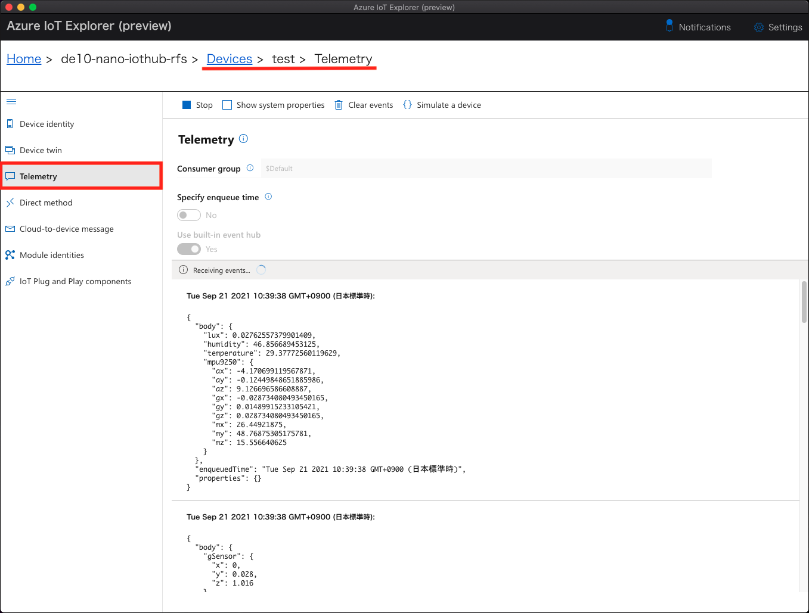

Confirm the telemetry is displayed in IoT Explorer's Telemetry window. The telemetry is displayed in `raw` format (or plain JSON payload).  

Example :

```json
{
  "body": {
    "lux": 38.437015533447266,
    "humidity": 51.617431640625,
    "temperature": 25.339336395263672,
    "mpu9250": {
      "ax": -0.1149216815829277,
      "ay": 0.14365209639072418,
      "az": 10.20887565612793,
      "gx": -0.003192675532773137,
      "gy": 0.01489915233105421,
      "gz": -0.003192675532773137,
      "mx": 20.9091796875,
      "my": 20.619140625,
      "mz": 61.7080078125
    }
  },
  "enqueuedTime": "Thu Oct 07 2021 16:04:34 GMT-0700 (Pacific Daylight Time)"
}
```

The telemetry data are further categorized into several types :

- Self-explanatory  
  e.g. telemetry with names such as `temperature` and `humidity`
- Difficult to understand or interpret  
  e.g. you may be able to guess there are a number of sensor data with `x`, `y`, and `z` axis such as ax, ay, az. But unlike temperature and humidity, making sense of the data is not straightforward.
- Requires measurement unit to interpret  
  e.g. just by looking at temperature data, you cannot tell if the temperature is in Celsius or Fahrenheit

Press `Stop` button before proceeding to the next step.

## Step 4.6: IoT Plug and Play Model Verification

As explained above, IoT Plug and Play Model adds metadata and attributes to IoT data, which in turns help users and solution developers to interpret the data.

These are 3 steps to successfully validate an IoT Plug and Play Model with IoT Explorer (vs. only validating IoT Plug and Play Model Definition files using `dmr-client`).

- Configure IoT Explorer to load an IoT Plug and Play model  
  Required if you have customized IoT Plug and Play model locally on development machine
- Observe telemetry in **Modeled View** (vs. raw data)
- Observe **Device Settings** from Cloud to Device

### Step 4.6.1: Configure IoT Explorer to reference Plug and Play model

IoT Explorer loads IoT Plug and Play Model definition file(s) in DTDLv2 format, and references the interfaces defined based on Digital Twin Model ID (DTMI). IoT Plug and Play Model(s) describe characteristics of the device, including telemetry a device can send and properties it can receive and report. The process of using a referenced DTMI to match against a model repository and parsing its contents is called **Model Resolution**, the process is analogous to converting device's host name to IP Address through DNS. 

In IoT Explorer, you can specify more than one location of `IoT Plug and Play Model Repository`, so **Model Resolution** process can involve multiple repositories.

THe supported types of Model Repository in IoT Explorer are :

- Public Model Repository hosted by Microsoft
- Private Model Repository that you set up  
- A Local Folder  

> [!NOTE]  
> The reference model is already published to Public Model Repository.
> If you are using IoT Plug and Play model as-is from the reference application, IoT Explorer can resolve the model using Public Repository.

If you have customized IoT Plug and Play model, make sure to add private repository orthe path of local folder that contains your model definition files. IoT Explorer must be able to access model definition file(s) to successfully resolve the model.

You may skip the remaining of this step if you are using the reference application and the IoT Plug and Play Model unchanged.

1. Open to IoT Explorer
1. Go back to `Home` in IoT Explorer (Click `Home`)
1. Click `IoT Plug and Play Settings` on the left pane
1. Click `Add`
1. Click `Local Folder`
1. Click `Pick a folder`
1. Browse to folder where your customized IoT Plug and Play model files are located  
  e.g. C:\MyModel
1. Click `Save` to save the setting

  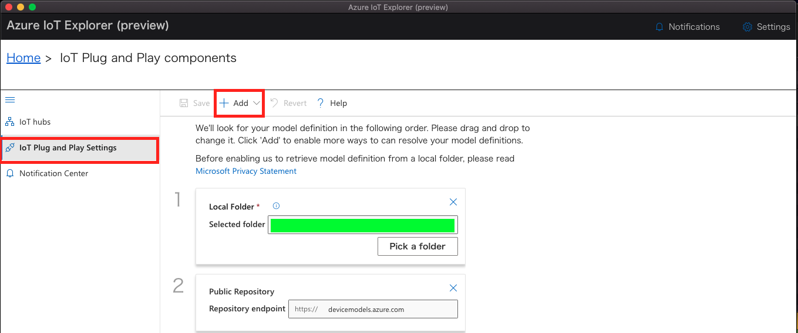


### Step 4.6.2: Resolve IoT Plug and Play model

1. Open IoT Explorer
1. Click `IoT hubs` on the left pane
1. Select IoT Hub that DE10-Nano is connected to
1. Select DE10-Nano device from the list of devices
1. Click `IoT Plug and Play components` from left pane

Confirm the following values :

- Model ID  
The field shows : `dtmi:Terasic:FCC:DE10_Nano:1`

- Components  
There are 3 components listed, and their respective DTMI
  - `gSensor`
  - `rfsSensors`
  - `thresholdProperty`

- Model contents  
IoT Explorer resolved model using DTMI, this view will display contents of IoT Plug and Play Model in DTDLv2 format.

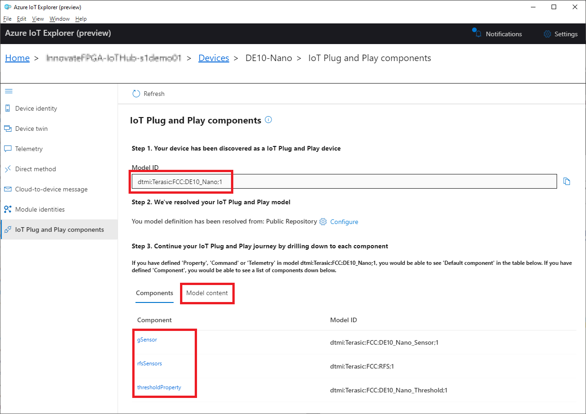

## Step 4.7 : View data in Modeled View

You have already verified telemetry sent from DE10-Nano to IoT Hub in raw data format in JSON. IoT Plug and Play Model adds attributes and/or annotations to the data, thus it can be understood within a specific context in your solution. For example, the temperature data from DE10-Nano is just real number. The application needs to know exact data format (`float`), measurement units(`Celcius`), etc... These additional information will be all available with Modeled View.

To view telemetry sent from DE10-Nano in **Modeled View**, please follow :

1. Make sure the reference application is running  

    If not [run the reference application](#step-44-connect-de10-nano-to-iot-hub) 

2. Select `IoT Plug and Play components` in the left navigation pane.  

    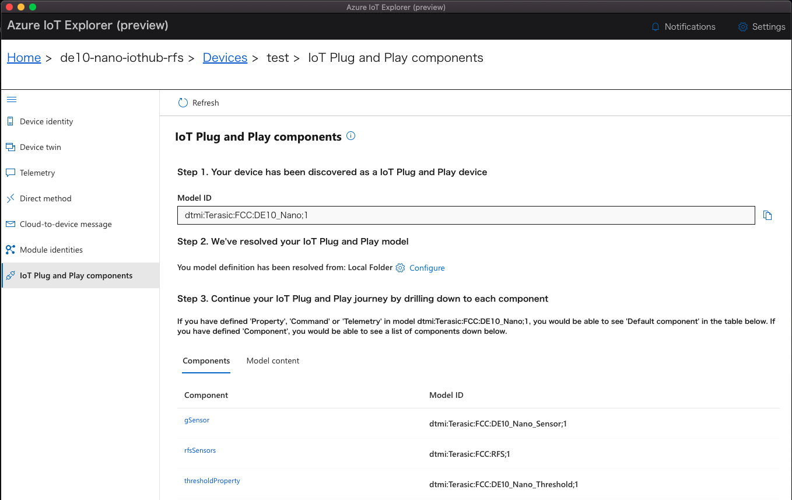

3. Click `rfsSensor` component

    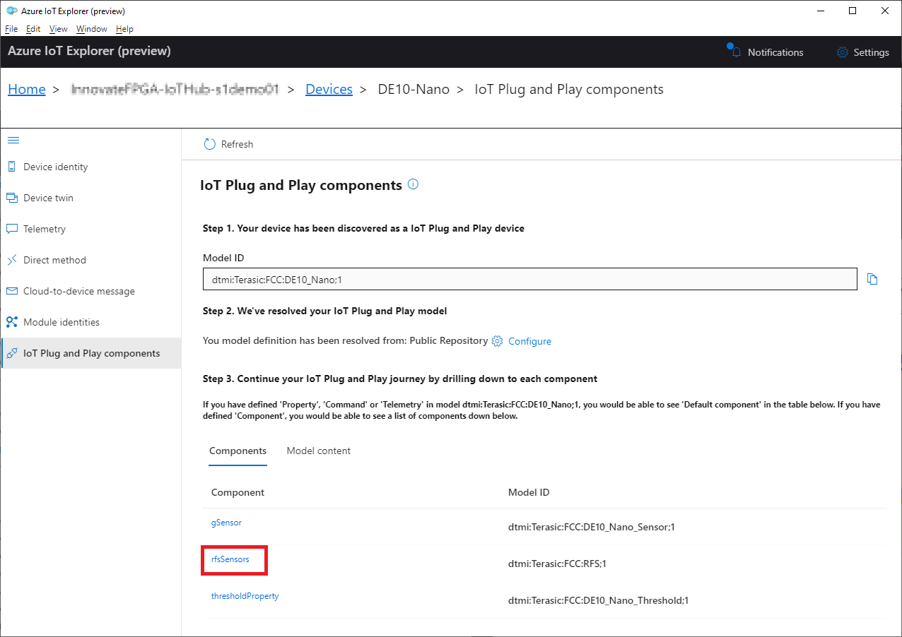

4. Click `Telemetry` tab.
5. Check `Show modeled events`
6. Click `Start` button.  

    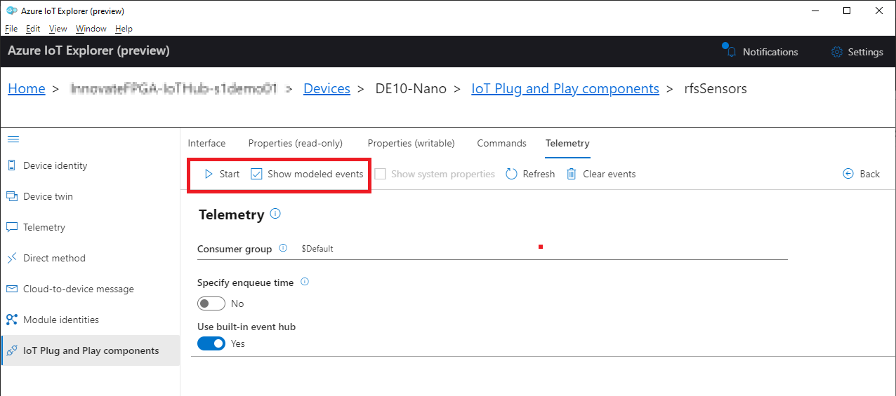

7. Confirm IoT Explorer displays telemetry data with model information such as schema and units information.

    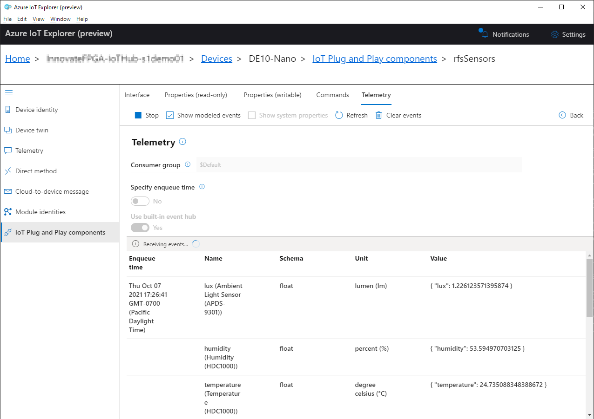

In this example, IoT Explorer is able to add metadata to sensor data by resolving the IoT Plug and Play Model. Your IoT Edge Module Application can do the same thought IoT Plug and Play Model.

Click `Stop` button before proceeding to the next step.

## Communication between IoT Devices and IoT Hub

IoT Hub supports 4 types of communications :

1. Telemetry, also known as Device-to-Cloud messaging (D2C)
1. Message from Cloud to a device, also known as Cloud-to-Device messaging (C2D)
1. Command from Cloud to a device, also known as Direct Method
1. Device Twin, also called **Properties** in IoT Plug and Play

Each of them has unique characteristics in terms of 1) communication flow, 2) data type, and 3) operations type.

Please refer to following documentations for more information :

- <https://docs.microsoft.com/azure/iot-hub/iot-hub-devguide-d2c-guidance>
- <https://docs.microsoft.com/azure/iot-hub/iot-hub-devguide-c2d-guidance>

## Step 4.8: Sending Data from Cloud

IoT Hub supports secure bidirectional communication with IoT Devices. The earlier step covers **Device to Cloud (D2C)** communication through IoT Device sending telemetry data to IoT Hub. This step however, will verify **Cloud to Device (C2D)** communication, through `Writable Property` (a.k.a. Desired Property) defined in IoT Plug and Play Model.  Unlike telemetry, IoT Hub saves all the property values, with a mechanism for device to acknowledge the valid values. IoT Devices may report its properties to IoT Hub, which is called `Read Only Property`, (a.k.a. Reported Property).

This reference application uses `Writable Property` in the IoT Plug and Play Model to set thresholds for sensors data that is used by the FPGA application to control LEDs. When sensor data goes beyond threshold values (min & max), FPGA application will toggle the corresponding LEDs.

1. Go back to `IoT Plug and Play components` of DE10-Nano in IoT Explorer
2. Click on `thresholdProperty` from component list  

    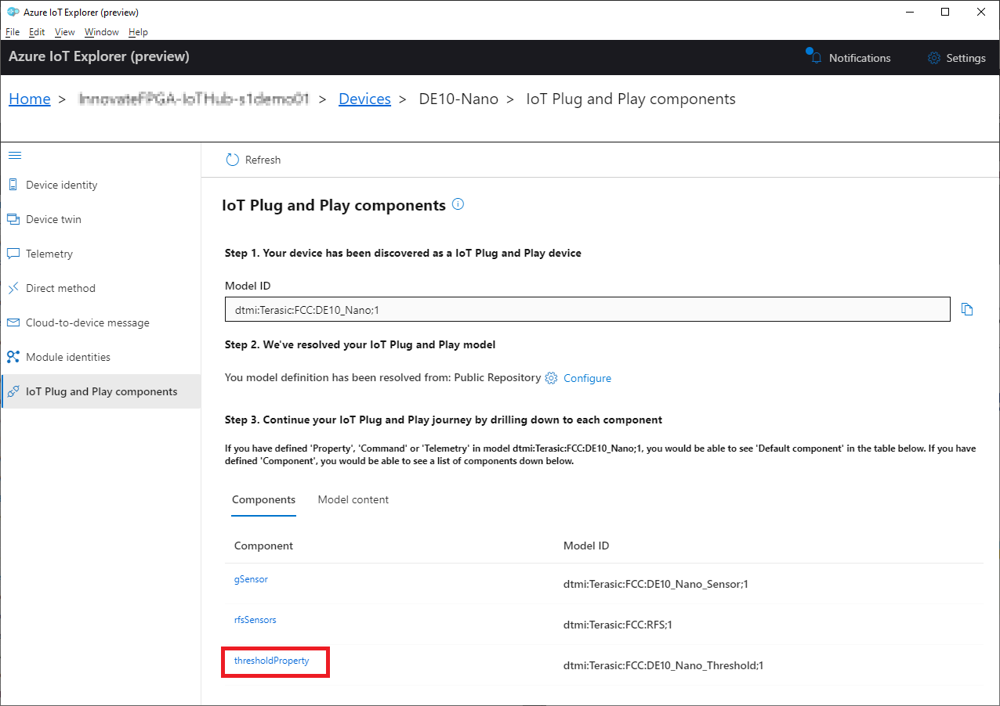

3. Click on `Properties (writable)`  
4. Click on `Click to view value` to see current settings reported by DE10-Nano

    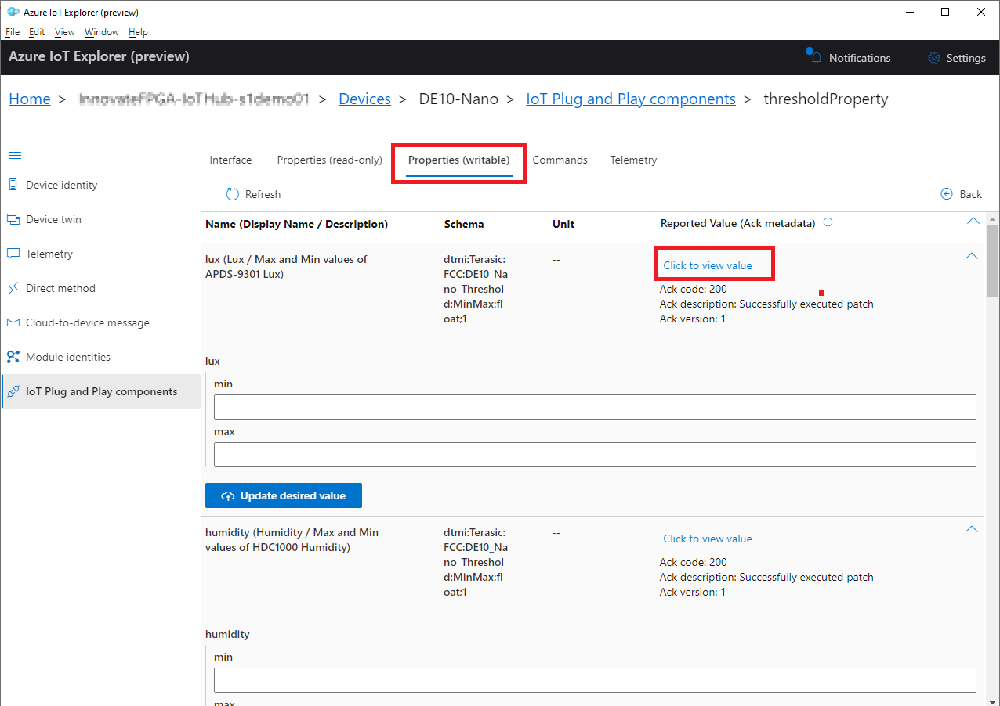

5. Enter `min` and `max` values  

    e.g. set min = 0 and max = 10 for `lux`

6. Click `Update desired value` button
7. Look at `Notifications`

    IoT Explorer shows status in `Notification`

    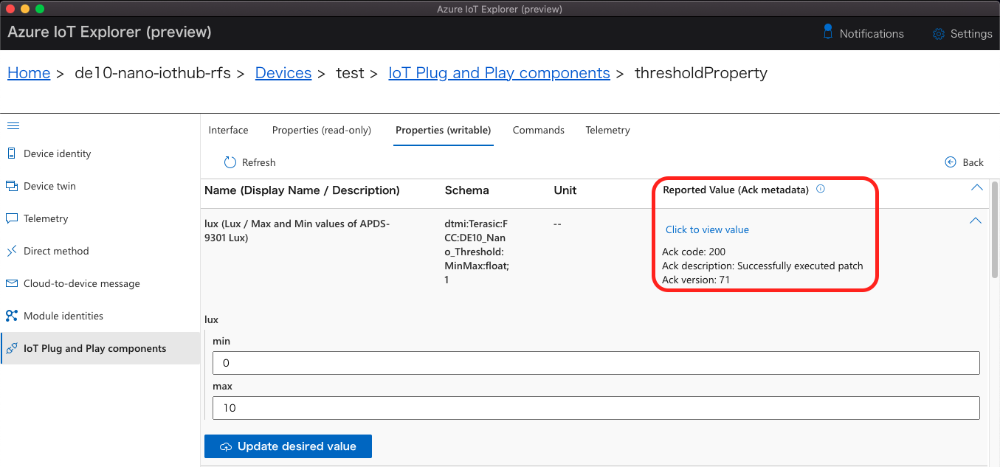

8. Click `Refresh` and observed `Reported Value(Ack metadata)` updated
9. Click `Click to view value` to see the new settings reported by DE10-Nano
10. Switch back to VSCode terminal window

    The reference application should display property updates in the console output

    ```bash
    {'thresholdProperty': {'__t': 'c', 'lux': {'min': 0, 'max': 10}}, '$version': 71}
    Values received are :-
    {'__t': 'c', 'lux': {'min': 0, 'max': 10}}
    New lux's Threshold is 0.0 - 10.0
    {'thresholdProperty': {'lux': {'ac': 200, 'ad': 'Successfully executed patch', 'av': 71, 'value': {'min': 0.0, 'max': 10.0}}}}
    ```

This changes the threshold for min and max value of `lux` for Luminosity. When sensor data go beyond the new threshold, LED will be toggled on or off to reflect the sensor data and its threshold.

You may stop the reference application by pressing `Q` in VSCode terminal.

---
Next Step: [Step 5: Container Development Phase](step5-container-development-phase.md)  
Previous Step : [Step 3: Plug and Play Model Development Phase](step3-pnp-model-development-phase.md)  

Tool Setup: [Prerequisites Guide](prerequisites.md)  
Learn this Design: [Sensor Aggregation Design Architecture](reference-design.md)  
Move to [Top](../top.md)