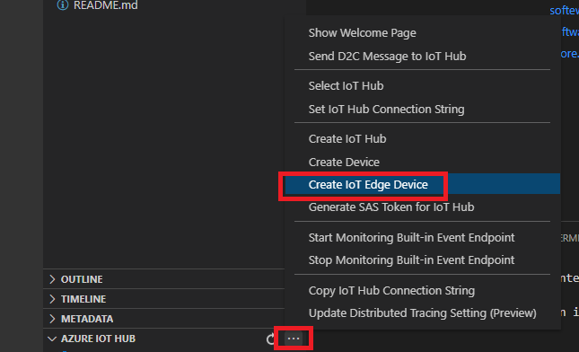
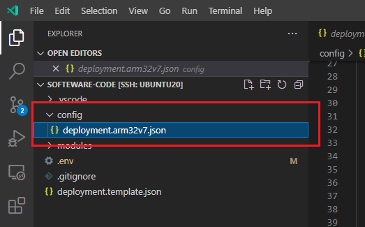
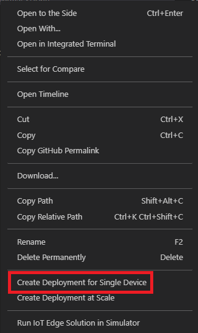
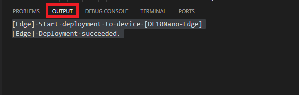

# Step 6: Azure IoT Module Enablement Phase

## Azure IoT Edge

Azure IoT Edge uses container technology to enable remote management of IoT devices and workloads to run on IoT devices. It consists of three main components:  

- IoT Edge Runtime  
  Services run on each IoT Edge Device. Responsible for IoT Hub connection and module deployment.

- IoT Edge System Modules  
  A part of IoT Edge Runtime and running as container images. There are two system modules.  
  - edgeAgent
  - edgeHub

- IoT Edge Modules  
  Containerized application written by users, such as the containerized reference application in **Step 5**. 

[More on Azure IoT Edge](https://docs.microsoft.com/azure/iot-edge/about-iot-edge?view=iotedge-2020-11)

## Goals

The goals for this step are :

- Install Azure IoT Edge Runtime on DE10-Nano
- Configure Azure IoT Edge to connect to IoT Hub
- Deploy IoT Edge Module (containerized reference application)

## Step 6.1: Preparation

### Step 6.1.1: Summary of Tools and Resources

List of tools and required resources used in this step 

- Development Machine
  - [Azure IoT Edge Extension](https://marketplace.visualstudio.com/items?itemName=vsciot-vscode.azure-iot-edge)

- DE10-Nano
  - Azure IoT Edge Runtime

- Files
  - `deployment.template.json`

### Step 6.1.2: Create IoT Edge device in IoT Hub

IoT Edge Runtime manages connection to IoT Hub. To connect an IoT Device to IoT Hub, you must provide provisioning information for the IoT Edge Runtime. In this step, we will use Device Connection String to connect to IoT Hub. As a start, we will need to create a new IoT Edge Device.

1. Switch to VSCode that is **NOT** connected to DE10-Nano  
2. Click `...` on `Azure IoT Hub` extension panel
3. Click `Create IoT Edge Device`

    

4. Give a name to the new IoT Edge Device  

    e.g. DE10-Nano-Edge

## Step 6.2: Install Azure IoT Edge Runtime to DE10-Nano

1. Open VSCode that is connected to DE10-Nano over SSH
1. Open a new Terminal or switch to an existing one
1. Download and install IoT Ege Runtime version 1.2.4

    ```bash
    mkdir ~/tmp && \
    cd ~/tmp && \
    curl -L https://github.com/Azure/azure-iotedge/releases/download/1.2.4/aziot-identity-service_1.2.3-1_ubuntu18.04_armhf.deb -o aziot-identity-service.deb && \
    apt-get install -y ./aziot-identity-service.deb && \
    curl -L https://github.com/Azure/azure-iotedge/releases/download/1.2.4/aziot-edge_1.2.4-1_ubuntu18.04_armhf.deb -o aziot-edge.deb && \
    apt-get install -y ./aziot-edge.deb
    ```

    <details><summary> Sample Output :</summary>

    ```bash
    root@de10nano:~#cd ~/tmp && \
    >     curl -L https://github.com/Azure/azure-iotedge/releases/download/1.2.4/aziot-identity-service_1.2.3-1_ubuntu18.04_armhf.deb -o aziot-identity-service.deb && \
    >     apt-get install -y ./aziot-identity-service.deb && \
    >     curl -L https://github.com/Azure/azure-iotedge/releases/download/1.2.4/aziot-edge_1.2.4-1_ubuntu18.04_armhf.deb -o aziot-edge.deb && \
    >     apt-get install -y ./aziot-edge.deb
      % Total    % Received % Xferd  Average Speed   Time    Time     Time  Current
                                     Dload  Upload   Total   Spent    Left  Speed
    100   660  100   660    0     0   2075      0 --:--:-- --:--:-- --:--:--  2075
    100 2981k  100 2981k    0     0  1150k      0  0:00:02  0:00:02 --:--:-- 7271k
    Reading package lists... Done
    Building dependency tree       
    Reading state information... Done
    Note, selecting 'aziot-identity-service' instead of './aziot-identity-service.deb'
    The following NEW packages will be installed:
      aziot-identity-service
    0 upgraded, 1 newly installed, 0 to remove and 2 not upgraded.
    Need to get 0 B/3,053 kB of archives.
    After this operation, 15.3 MB of additional disk space will be used.
    Get:1 /root/tmp/aziot-identity-service.deb aziot-identity-service armhf 1.2.3-1 [3,053 kB]
    Selecting previously unselected package aziot-identity-service.
    (Reading database ... 73335 files and directories currently installed.)
    Preparing to unpack .../tmp/aziot-identity-service.deb ...
    Unpacking aziot-identity-service (1.2.3-1) ...

    :

    Unpacking aziot-edge (1.2.4-1) ...
    Setting up aziot-edge (1.2.4-1) ...
    ===============================================================================
    
                                  Azure IoT Edge
    
      IMPORTANT: Please configure the device with provisioning information.
    
      Please create a new system configuration.
    
      You can quickly configure the device for manual provisioning with
       a connection string using:
    
        sudo iotedge config mp --connection-string '...'
    
      For other provisioning options, copy the template file 
      at /etc/aziot/config.toml.edge.template to /etc/aziot/config.toml,
      update it with your device information, then apply the configuration to
      the IoT Edge services with:
    
        sudo iotedge config apply
    
    ===============================================================================
    Created symlink /etc/systemd/system/sockets.target.wants/aziot-edged.mgmt.socket → /lib/systemd/system/aziot-edged.mgmt.socket.
    Created symlink /etc/systemd/system/multi-user.target.wants/aziot-edged.service → /lib/systemd/system/aziot-edged.service.
    Created symlink /etc/systemd/system/sockets.target.wants/aziot-edged.workload.socket → /lib/systemd/system/aziot-edged.workload.socket.
    Processing triggers for man-db (2.8.3-2ubuntu0.1) ...
    ```

    </details>

1. Confirm IoT Edge is successfully installed by `iotedge system status` command

    Sample Output :

    ```bash
    root@de10nano:~# iotedge system status
    System services:
        aziot-edged             Ready
        aziot-identityd         Ready
        aziot-keyd              Ready
        aziot-certd             Ready
        aziot-tpmd              Ready
    
    Use 'iotedge system logs' to check for non-fatal errors.
    Use 'iotedge check' to diagnose connectivity and configuration issues.
    ```

1. Remove any temporary files

    ```bash
    cd ~
    rm -r -f ~/tmp
    ```

## Step 6.3: Configure IoT Edge Runtime

IoT Edge Runtime configuration is done through `/etc/aziot/config.toml` file.  Create `config.toml` from `config.toml.edge.template` and add device authentication information.

1. Create `config.toml` file from the template file with :

    ```bash
    cp /etc/aziot/config.toml.edge.template /etc/aziot/config.toml
    ```

2. Open `config.toml` with your favorite text editor such as vi or nano

    Example:

    ```bash
    nano /etc/aziot/config.toml
    ```

3. Navigate to the `Manual provisioning with connection string` section (line 76~)

    ```toml
    ## Manual provisioning with connection string
    #
    # [provisioning]
    # source = "manual"
    # connection_string = "HostName=example.azure-devices.net;DeviceId=my-device;SharedAccessKey=YXppb3QtaWRlbnRpdHktc2VydmljZXxhemlvdC1pZGU="
    ```

4. Uncomment the lines by removing `#` at the beginning of each line

    Before

    ```toml
    ## Manual provisioning with connection string
    #
    # [provisioning]
    # source = "manual"
    # connection_string = "HostName=example.azure-devices.net;DeviceId=my-device;SharedAccessKey=YXppb3QtaWRlbnRpdHktc2VydmljZXxhemlvdC1pZGU="
    ```

    After

    ```toml
    ## Manual provisioning with connection string
    #
    [provisioning]
    source = "manual"
    connection_string = "HostName=example.azure-devices.net;DeviceId=my-device;SharedAccessKey=YXppb3QtaWRlbnRpdHktc2VydmljZXxhemlvdC1pZGU="
    ```

5. Copy device connection string of the newly created IoT Edge device, and set to `connection_string`

    Before

    ```toml
    connection_string = "HostName=example.azure-devices.net;DeviceId=my-device;SharedAccessKey=YXppb3QtaWRlbnRpdHktc2VydmljZXxhemlvdC1pZGU="
    ```

    After

    ```toml
    connection_string = "Connection String from VSCode or IoT Explorer"
    ```

6. Save the changes and close the editor  

    e.g. With Nano editor, `ctrl+x` -> `y` -> `Enter`

7. Apply the configuration with `iotedge config apply` command

    Sample Output :

    ```bash
    root@de10nano:~/tmp# iotedge config apply
    Note: Symmetric key will be written to /var/secrets/aziot/keyd/device-id
    Azure IoT Edge has been configured successfully!
    
    Restarting service for configuration to take effect...
    Stopping aziot-edged.service...Stopped!
    Stopping aziot-identityd.service...Stopped!
    Stopping aziot-keyd.service...Stopped!
    Stopping aziot-certd.service...Stopped!
    Stopping aziot-tpmd.service...Stopped!
    Starting aziot-edged.mgmt.socket...Started!
    Starting aziot-edged.workload.socket...Started!
    Starting aziot-identityd.socket...Started!
    Starting aziot-keyd.socket...Started!
    Starting aziot-certd.socket...Started!
    Starting aziot-tpmd.socket...Started!
    Starting aziot-edged.service...Started!
    Done.
    ```

8. Wait a few minutes for the initial configuration to complete

    > [!TIP]  
    > You can monitor progress with `iotedge system logs -- -f`

    Check status of IoT Edge services with `iotedge system status`

    Sample Output :

    ```bash
    root@de10nano:~/tmp# iotedge system status
    System services:
        aziot-edged             Running
        aziot-identityd         Running
        aziot-keyd              Running
        aziot-certd             Running
        aziot-tpmd              Ready
    
    Use 'iotedge system logs' to check for non-fatal errors.
    Use 'iotedge check' to diagnose connectivity and configuration issues.
    ```

    *Note : aziot-tpmd stays in Ready status since we are not using TPM*

    Confirm `edgeAgent` module is running with `iotedge list`

    Output example:

    ```bash
    root@de10nano:~/tmp# iotedge list
    NAME             STATUS           DESCRIPTION      CONFIG
    edgeAgent        running          Up 2 minutes     mcr.microsoft.com/azureiotedge-agent:1.2
    ```

    > [!TIP]  
    > IoT Edge Runtime installs `edgeAgent` system modules. Once a IoT Edge Module is deployed, `edgeHub` system module will be started as wwell.
    > You can check status of IoT Edge system modules with docker command as well.
    >
    > Sample Output :
    >
    > ```bash
    > root@de10nano:~/tmp# docker ps
    > CONTAINER ID   IMAGE                                      COMMAND                  CREATED         STATUS              PORTS     NAMES
    > 9207b1fb01c1   mcr.microsoft.com/azureiotedge-agent:1.2   "/bin/sh -c 'exec /a…"   2 minutes ago   Up About a minute             edgeAgent
    > ```

## Step 6.4: Deploy IoT Edge Module

`edgeAgent` system module is listening to IoT Hub for IoT Edge Module deployment, which is done through `Deployment Manifest` of JSON format.

Deployment Manifest describes :

- System modules to deploy and settings
- User modules to deploy and settings
- Message Routing settings among modules and IoT Hub connections

Learn more about `Deployment Manifest` at [Azure IoT Edge documentation](https://docs.microsoft.com/azure/iot-edge/module-composition?view=iotedge-2020-11).

To deploy the reference application container using deployment manifest, follows the steps below : 

1. Open VSCode that is **NOT** connected to DE10-Nano
2. Open reference application in VSCode (software-code folder)

    e.g. `~/terasic-de10-nano-kit/azure-de10nano-document/sensor-aggregation-reference-design-for-azure/sw/software-code/`

3. Right click on `deployment.template.json`
4. Click `Generate IoT Edge Deployment Manifest`  

    This will generate deployment manifest in `config` folder

    

5. Right click `deployment.arm32v7.json` then select `Create Deployment for Single Device`

    

6. Select DE10-Nano device ID from the list  

    *Note : VSCode displays list of devices at the top of VSCode window*

7. Confirm the deployment was successful

    *Note : VSCode displays status in `OUTPUT` window*

    

## IoT Edge Module

The deployment may take several minutes depending on network speed, since DE10-Nano needs to download containers from Azure Container Registry.

To check deployment progress, you can use following techniques.

### Status from IoT Edge Runtime

Check status of IoT Edge modules with `iotedge list` command to see list of running modules

### IoT Edge Runtime Log

Check logs from IoT Edge Runtime with `iotedge system logs` command.

`Ctrl+C` to exit log view.

<details><summary> Sample Output : </summary>

```bash
root@de10nano:~# iotedge system logs -- -f
-- Logs begin at Thu 2021-08-26 14:20:42 UTC. --
Oct 08 22:16:32 de10nano aziot-keyd[17914]: 2021-10-08T22:16:32Z [INFO] - <-- POST /derivedkey/export?api-version=2020-09-01 {"content-type": "application/json", "host": "keyd.sock", "content-length": "748"}
Oct 08 22:16:32 de10nano aziot-keyd[17914]: 2021-10-08T22:16:32Z [INFO] - --> 200 {"content-type": "application/json"}
Oct 08 22:16:32 de10nano aziot-keyd[17914]: 2021-10-08T22:16:32Z [INFO] - <-- GET /key/device-id?api-version=2020-09-01 {"host": "keyd.sock"}
Oct 08 22:16:32 de10nano aziot-keyd[17914]: 2021-10-08T22:16:32Z [INFO] - --> 200 {"content-type": "application/json"}
Oct 08 22:16:32 de10nano aziot-keyd[17914]: 2021-10-08T22:16:32Z [INFO] - <-- POST /sign?api-version=2020-09-01 {"content-type": "application/json", "host": "keyd.sock", "content-length": "402"}
Oct 08 22:16:32 de10nano aziot-keyd[17914]: 2021-10-08T22:16:32Z [INFO] - --> 200 {"content-type": "application/json"}
Oct 08 22:16:32 de10nano aziot-certd[17925]: 2021-10-08T22:16:32Z [INFO] - --> 200 {"content-type": "application/json"}
Oct 08 22:16:32 de10nano aziot-edged[17897]: 2021-10-08T22:16:32Z [INFO] - Listening on fd://aziot-edged.workload.socket with 1 thread for workload API.
Oct 08 22:16:32 de10nano aziot-identityd[17911]: 2021-10-08T22:16:32Z [INFO] - --> 200 {"content-type": "application/json"}
Oct 08 22:16:32 de10nano aziot-edged[17897]: 2021-10-08T22:16:32Z [INFO] - Pulling image via tag mcr.microsoft.com/azureiotedge-agent:1.2...
Oct 08 22:21:18 de10nano aziot-edged[17897]: 2021-10-08T22:21:18Z [INFO] - Successfully pulled image mcr.microsoft.com/azureiotedge-agent:1.2
Oct 08 22:21:18 de10nano aziot-edged[17897]: 2021-10-08T22:21:18Z [INFO] - Creating module edgeAgent...
Oct 08 22:21:18 de10nano aziot-edged[17897]: 2021-10-08T22:21:18Z [INFO] - Creating image via tag mcr.microsoft.com/azureiotedge-agent:1.2...
Oct 08 22:21:22 de10nano aziot-edged[17897]: 2021-10-08T22:21:22Z [INFO] - Successfully created module edgeAgent
Oct 08 22:21:22 de10nano aziot-edged[17897]: 2021-10-08T22:21:22Z [INFO] - Starting module edgeAgent...
Oct 08 22:21:22 de10nano aziot-edged[17897]: 2021-10-08T22:21:22Z [INFO] - Starting new listener for module edgeAgent
Oct 08 22:21:22 de10nano aziot-certd[17925]: 2021-10-08T22:21:22Z [INFO] - <-- GET /certificates/aziot-edged-ca?api-version=2020-09-01 {"host": "2f72756e2f617a696f742f63657274642e736f636b:0"}
Oct 08 22:21:22 de10nano aziot-certd[17925]: 2021-10-08T22:21:22Z [INFO] - --> 200 {"content-type": "application/json"}
Oct 08 22:21:22 de10nano aziot-edged[17897]: 2021-10-08T22:21:22Z [INFO] - Listening on unix:///var/lib/aziot/edged/mnt/edgeAgent.sock with 1 thread for workload API.
Oct 08 22:21:26 de10nano aziot-edged[17897]: 2021-10-08T22:21:26Z [INFO] - Successfully started module edgeAgent
Oct 08 22:21:26 de10nano aziot-edged[17897]: 2021-10-08T22:21:26Z [INFO] - Checking edge runtime status
Oct 08 22:21:26 de10nano aziot-edged[17897]: 2021-10-08T22:21:26Z [INFO] - Edge runtime is running.

```

</details>

### IoT Edge Module Log

Check logs from IoT Edge Module with `iotedge logs <module name>`

> [!TIP]  
> You can display logs from system modules (edgeAgent and edgeHub) as well.

`Ctrl+C` to exit log view.

<details><summary> Sample Output : </summary>

```bash
root@de10nano:~# iotedge logs edgeAgent
2021-10-08 22:21:26 +00:00 Starting Edge Agent
2021-10-08 22:21:27 +00:00 Changing ownership of management socket: /var/run/iotedge/mgmt.sock
2021-10-08 22:21:28.720 +00:00 Edge Agent Main()
<6> 2021-10-08 22:21:35.490 +00:00 [INF] - Initializing Edge Agent.
<6> 2021-10-08 22:21:37.651 +00:00 [INF] - Version - 1.2.4.47309863 (d23e0cafc3a1e4b9741b99cba8077a6df3f015c6)
<6> 2021-10-08 22:21:37.657 +00:00 [INF] - 
        █████╗ ███████╗██╗   ██╗██████╗ ███████╗
       ██╔══██╗╚══███╔╝██║   ██║██╔══██╗██╔════╝
       ███████║  ███╔╝ ██║   ██║██████╔╝█████╗
       ██╔══██║ ███╔╝  ██║   ██║██╔══██╗██╔══╝
       ██║  ██║███████╗╚██████╔╝██║  ██║███████╗
       ╚═╝  ╚═╝╚══════╝ ╚═════╝ ╚═╝  ╚═╝╚══════╝

 ██╗ ██████╗ ████████╗    ███████╗██████╗  ██████╗ ███████╗
 ██║██╔═══██╗╚══██╔══╝    ██╔════╝██╔══██╗██╔════╝ ██╔════╝
 ██║██║   ██║   ██║       █████╗  ██║  ██║██║  ███╗█████╗
 ██║██║   ██║   ██║       ██╔══╝  ██║  ██║██║   ██║██╔══╝
 ██║╚██████╔╝   ██║       ███████╗██████╔╝╚██████╔╝███████╗
 ╚═╝ ╚═════╝    ╚═╝       ╚══════╝╚═════╝  ╚═════╝ ╚══════╝

<6> 2021-10-08 22:21:38.142 +00:00 [INF] - Experimental features configuration: {"Enabled":false,"DisableCloudSubscriptions":false}
<6> 2021-10-08 22:21:39.680 +00:00 [INF] - Installing certificates [CN=iotedged workload ca de10nano:01/06/2022 22:12:31] to Root
<6> 2021-10-08 22:21:40.966 +00:00 [INF] - Starting metrics listener on Host: *, Port: 9600, Suffix: metrics
<6> 2021-10-08 22:21:41.504 +00:00 [INF] - Updating performance metrics every 05m:00s
<6> 2021-10-08 22:21:41.562 +00:00 [INF] - Started operation Get system resources
<6> 2021-10-08 22:21:41.579 +00:00 [INF] - Collecting metadata metrics
<6> 2021-10-08 22:21:42.493 +00:00 [INF] - Set metadata metrics: 1.2.4.47309863 (d23e0cafc3a1e4b9741b99cba8077a6df3f015c6), {"Enabled":false,"DisableCloudSubscriptions":false}, {"OperatingSystemType":"linux","Architecture":"armv7l","Version":"1.2.4","Provisioning":{"Type":"ProvisioningType","DynamicReprovisioning":false,"AlwaysReprovisionOnStartup":false},"ServerVersion":"20.10.9+azure-1","KernelVersion":"4.14.130-ltsi+","OperatingSystem":"Ubuntu 18.04.6 LTS","NumCpus":2,"Virtualized":"no"}, True
<6> 2021-10-08 22:21:42.671 +00:00 [INF] - Started operation Checkpoint Availability
<6> 2021-10-08 22:21:42.701 +00:00 [INF] - Started operation refresh twin config
<6> 2021-10-08 22:21:43.045 +00:00 [INF] - Edge agent attempting to connect to IoT Hub via Amqp_Tcp_Only...
<6> 2021-10-08 22:21:50.637 +00:00 [INF] - Created persistent store at /tmp/edgeAgent
<6> 2021-10-08 22:21:51.395 +00:00 [INF] - Started operation Metrics Scrape
<6> 2021-10-08 22:21:51.397 +00:00 [INF] - Started operation Metrics Upload
Scraping frequency: 01:00:00
Upload Frequency: 1.00:00:00
<6> 2021-10-08 22:21:56.055 +00:00 [INF] - Registering request handler UploadModuleLogs
<6> 2021-10-08 22:21:56.056 +00:00 [INF] - Registering request handler GetModuleLogs
<6> 2021-10-08 22:21:56.058 +00:00 [INF] - Registering request handler UploadSupportBundle
<6> 2021-10-08 22:21:56.059 +00:00 [INF] - Registering request handler RestartModule
<6> 2021-10-08 22:21:56.646 +00:00 [INF] - Edge agent connected to IoT Hub via Amqp_Tcp_Only.
<6> 2021-10-08 22:21:58.460 +00:00 [INF] - Initialized new module client with subscriptions enabled
<6> 2021-10-08 22:21:59.209 +00:00 [INF] - Obtained Edge agent twin from IoTHub with desired properties version 7 and reported properties version 16.
<4> 2021-10-08 22:22:02.694 +00:00 [WRN] - Empty edge agent config was received. Attempting to read config from backup (/tmp/edgeAgent/backup.json) instead
<6> 2021-10-08 22:22:02.737 +00:00 [INF] - Edge agent config backup file does not exist - /tmp/edgeAgent/backup.json
<6> 2021-10-08 22:22:05.470 +00:00 [INF] - Updated reported properties
<6> 2021-10-08 22:22:14.618 +00:00 [INF] - Plan execution started for deployment 7
<6> 2021-10-08 22:22:14.814 +00:00 [INF] - Executing command: "Command Group: (\n  [Create module RfsModule]\n  [Start module RfsModule]\n)"
<6> 2021-10-08 22:22:14.857 +00:00 [INF] - Executing command: "Create module RfsModule"
```

</details>

---
Next Step: [Step 7: Azure IoT Central Application Development Phase](step7-azure-iot-central-application-development-phase.md)  
Previous Step: [Step 5: Container Development Phase](step5-container-development-phase.md)

Tool Setup: [Prerequisites Guide](prerequisites.md)  
Learn this Design: [Sensor Aggregation Design Architecture](reference-design.md)  
Move to [Top](../top.md)